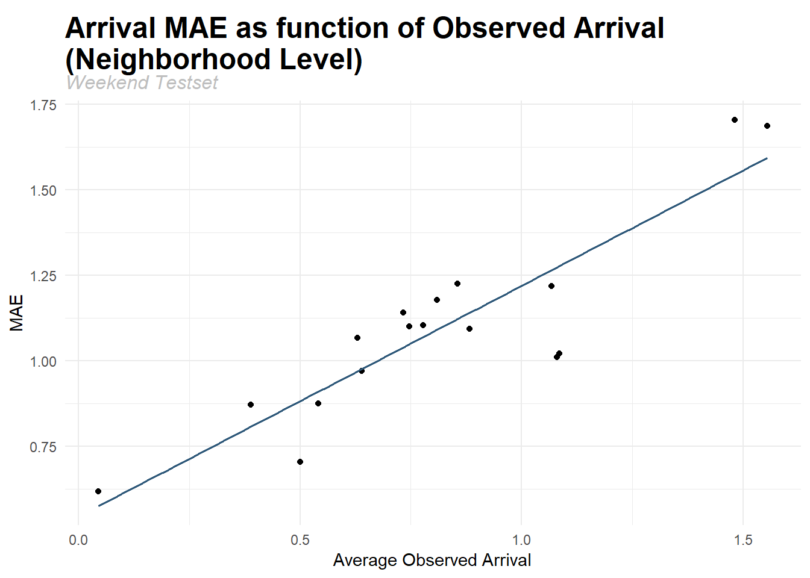
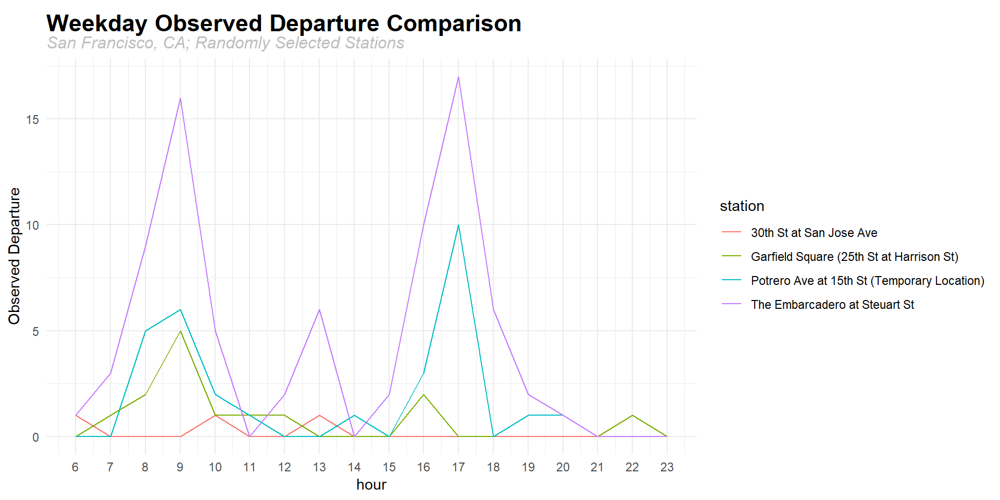

# Predicting Bike Departure and Arrival in San Francisco

* [1. Introduction](#link1)
* [2. Data](#link2)
* [3. Exploratory Analysis](#link3)
    + [3.1. Distribution of dependent variable](#link4)
    + [3.2. Number of departures/arrivals in each day](#link5)
    + [3.3. Number of departures/arrivals in each neighborhood](#link6)
    + [3.4. Spatial autocorrelation](#link7)
    + [3.5. Temporal autocorrelation](#link8)
    + [3.6. Popular stations on weekdays and at weekend](#link9)
    + [3.7. Relationship between dependent and independent variables](#link10)
    + [3.8. Summary Statistics](#link11)
* [4. Model Building](#link12)
* [5. Model Validation](#link13)
    + [5.1. In-Sample Prediction](#link14)
    + [5.2. Out-of-sample Prediction](#link15)
    + [5.3. Cross-Validation](#link16)
    + [5.4. Generalizability across space](#link17)
        - [5.4.1. Across stations](#link18)
        - [5.4.2. Across neighborhoods](#link19)
    + [5.5. Generalizability across time](#link20)
    + [5.6. Spatial Autocorrelation](#link21)
    + [5.7. Temporal Autocorrelation](#link22)
    + [5.8. Conclusion](#link23)
* [6. Use Case](#link24)
    + [6.1. The App at a glance](#link25)
    + [6.2. The App in detail](#link26)
        - [6.2.1. Plan your trip](#link27)
        - [6.2.2. Recommend three routes](#link28)
        - [6.2.3. Customize your route](#link29)
* [7. Potential Improvement](#link30)
    + [7.1. Modeling weekday and weekend separately](#link31)
    + [7.2. Identifying different patterns across time for different stations](#link32)
    + [7.3. Amplifying the effect of peak hours](#link33)
    + [7.4. Modeling the difference between arrival and departure](#link34)
* [Appendix](#link35)


# 1. Introduction

Beginning operation in 2013, the Ford GoBike system currently has over 2,600 bicycles in 262 stations across San Francisco, East Bay and San Jose. Similar to other bike sharing systems in the country, Ford GoBike has suffered from the problem of systematic imbalance. Temporally, bikes tend to pile up downtown in the morning and on the outskirts in the afternoon. Spatially, people are happy to rent a bike and roll on down the hill, but reluctant to go the other way. Therefore, it is common to see that some stations are empty (or full), preventing users from borrowing (or returning) bikes. These imbalances cause inconvenience in using Ford GoBike services. 

In order to make Ford Gobike more connected, smart, and efficient, we have designed an App to deal with the imbalance problem. With the new App, users are able to plan their trips by setting a location and a future departure time. The App will show the predicted number of bikes and docks in the time selected. Then, it will provide three most recommended routes according to the availability of bikes and docks at the origin and destination, respectively. The App will also encourage users moving bikes from full stations to empty stations by giving bonus points as coupons. 

The main use case of the App, namely predicting hourly bike/dock availability, is based on two Poisson Regression models. Though there are still rooms for improvement, the models are proved to be both accurate and generalizable. Overall, the differences between predicted and observed values are less than 1.7, indicating the number of departure/arrival our model generates will just slightly differ from the true values. Additionally, the models’ performances are quite stable across time and space. We thus firmly believe this methodology can guide the rebalancing process of Ford Gobike, as well as the bike sharing systems in other U.S. cities. 

The rest of this material will detail the model building and validation process, and how these models meet the use case we set out to address.

***

# 2. Data

The purposes of our models are to predict hourly departure and arrival of each bikeshare station, respectively. We select 144 Ford GoBike stations, and download bike trip records from 10/14/2018 to 10/20/2018. Below shows the location of the stations involved in this study.


```r
ggmap(map) +
  geom_point(data = sf_bike_WGS.xy, aes(x = X, y = Y), color = '#244ead')  +
  labs(title = "Location of Stations in Study",
       subtitle = 'San Francisco, CA') +
  theme(plot.title=element_text(size=17, face="bold", vjust=-1),
        plot.subtitle=element_text(size=12, face="italic", color="grey"),
        legend.text = element_text(face = "italic"),
        axis.ticks = element_blank(),
        axis.text = element_blank(),
        axis.title.x = element_blank(),
        axis.title.y = element_blank(),
        panel.border = element_rect(colour = "grey", fill=NA, size=2))
```


Independent variables include seven categories - internal characteristics, access to amenities, natural environment, social characteristics, land use, time, and lagged variables. Detailed information of the variables we use are shown in the table below.

<table class="table" style="font-size: 15px; width: auto !important; margin-left: auto; margin-right: auto;">
<caption style="font-size: initial !important;">Summary of Variables in the Prediction Model</caption>
 <thead>
  <tr>
   <th style="text-align:left;"> Variable </th>
   <th style="text-align:left;"> Category </th>
   <th style="text-align:left;"> Symbol </th>
   <th style="text-align:left;"> Description </th>
  </tr>
 </thead>
<tbody>
  <tr>
   <td style="text-align:left;font-weight: bold;vertical-align: middle !important;" rowspan="2"> Dependent variable </td>
   <td style="text-align:left;vertical-align: middle !important;" rowspan="2"> ----- </td>
   <td style="text-align:left;"> departure </td>
   <td style="text-align:left;"> Number of hourly departure </td>
  </tr>
  <tr>
   
   
   <td style="text-align:left;"> arrival </td>
   <td style="text-align:left;"> Number of hourly Arrival </td>
  </tr>
  <tr>
   <td style="text-align:left;font-weight: bold;vertical-align: middle !important;" rowspan="35"> Independent variable </td>
   <td style="text-align:left;vertical-align: middle !important;" rowspan="2"> Internal characteristic </td>
   <td style="text-align:left;"> eastMost </td>
   <td style="text-align:left;"> Dummy variable. Whether the station is located in Financial District, Mission Bay, Mission, or South of Market </td>
  </tr>
  <tr>
   
   
   <td style="text-align:left;"> weekend_hot </td>
   <td style="text-align:left;"> Dummy variable. Whether the station is popular at weekends </td>
  </tr>
  <tr>
   
   <td style="text-align:left;vertical-align: middle !important;" rowspan="6"> Access to ameneties </td>
   <td style="text-align:left;"> dist_Park1 </td>
   <td style="text-align:left;"> Distance to nearest park </td>
  </tr>
  <tr>
   
   
   <td style="text-align:left;"> log_dist_ferryBuilding </td>
   <td style="text-align:left;"> Distance to San Francisco Ferry Building Station in log format </td>
  </tr>
  <tr>
   
   
   <td style="text-align:left;"> log_dist_bus3 </td>
   <td style="text-align:left;"> Average distance to nearest 3 bus stops in log format </td>
  </tr>
  <tr>
   
   
   <td style="text-align:left;"> log_dist_Townsend </td>
   <td style="text-align:left;"> Distance to San Francisco Caltrain (Townsend St at 4th St) Station in log format </td>
  </tr>
  <tr>
   
   
   <td style="text-align:left;"> log_dist_crash1 </td>
   <td style="text-align:left;"> Distance to the nearest crash in log format </td>
  </tr>
  <tr>
   
   
   <td style="text-align:left;"> log_dist_bus1 </td>
   <td style="text-align:left;"> Distance to the nearest bus stop in log format </td>
  </tr>
  <tr>
   
   <td style="text-align:left;vertical-align: middle !important;" rowspan="2"> Natural environment </td>
   <td style="text-align:left;"> Condition </td>
   <td style="text-align:left;"> Categorical variable. Weather condition. There are 10 levels in total - cloudy, cloudy/windy, fair, fair/windy, fog, haze, mostly cloudy, mostly cloudy/windy, partly cloudy, partly cloudy/windy. </td>
  </tr>
  <tr>
   
   
   <td style="text-align:left;"> Wind.Speed </td>
   <td style="text-align:left;"> Speed of wind </td>
  </tr>
  <tr>
   
   <td style="text-align:left;vertical-align: middle !important;" rowspan="8"> Social characteristic </td>
   <td style="text-align:left;"> log_jobs </td>
   <td style="text-align:left;"> Number of jobs in the census block group where the station is located (after log transformation) </td>
  </tr>
  <tr>
   
   
   <td style="text-align:left;"> pop </td>
   <td style="text-align:left;"> Number of population in the census block group where the station is located </td>
  </tr>
  <tr>
   
   
   <td style="text-align:left;"> log_dist_crime1 </td>
   <td style="text-align:left;"> Distance to the nearest crime in log format </td>
  </tr>
  <tr>
   
   
   <td style="text-align:left;"> log_transit </td>
   <td style="text-align:left;"> Number of people taking transit to work in the census block group where the station is located (after log transformation) </td>
  </tr>
  <tr>
   
   
   <td style="text-align:left;"> houseAge </td>
   <td style="text-align:left;"> Median house age in the census block group where the station is located </td>
  </tr>
  <tr>
   
   
   <td style="text-align:left;"> log_housingUnits </td>
   <td style="text-align:left;"> Number of housing units in the census block group where the station is located (after log transformation) </td>
  </tr>
  <tr>
   
   
   <td style="text-align:left;"> housingUnits </td>
   <td style="text-align:left;"> Number of housing units in the census block group where the station is located </td>
  </tr>
  <tr>
   
   
   <td style="text-align:left;"> log_bike </td>
   <td style="text-align:left;"> Number of people taking bicycle to work in the census block group where the station is located (after log transformation) </td>
  </tr>
  <tr>
   
   <td style="text-align:left;vertical-align: middle !important;" rowspan="4"> Land use </td>
   <td style="text-align:left;"> log_pct_VACANT </td>
   <td style="text-align:left;"> Percentage of vacant land in the half-mile buffer of bikeshare station (after log transformation) </td>
  </tr>
  <tr>
   
   
   <td style="text-align:left;"> MIPS </td>
   <td style="text-align:left;"> Square footage of office land use in the half-mile buffer of bikeshare station </td>
  </tr>
  <tr>
   
   
   <td style="text-align:left;"> pct_VACANT </td>
   <td style="text-align:left;"> Percentage of vacant land in the half-mile buffer of bikeshare station </td>
  </tr>
  <tr>
   
   
   <td style="text-align:left;"> log_MED </td>
   <td style="text-align:left;"> Square footage of medical land use in the half-mile buffer of bikeshare station (after log transformation) </td>
  </tr>
  <tr>
   
   <td style="text-align:left;"> Time </td>
   <td style="text-align:left;"> whichday </td>
   <td style="text-align:left;"> Categorical variable. There are 7 levels in total - Mon, Tue, Wed, Thur, Fri, Sat, and Sun </td>
  </tr>
  <tr>
   
   <td style="text-align:left;vertical-align: middle !important;" rowspan="7"> Lag (time) </td>
   <td style="text-align:left;"> departure_3h </td>
   <td style="text-align:left;"> Number of departure 3 hours ago </td>
  </tr>
  <tr>
   
   
   <td style="text-align:left;"> departure_24h </td>
   <td style="text-align:left;"> Number of departure 24 hours ago </td>
  </tr>
  <tr>
   
   
   <td style="text-align:left;"> departure_1w </td>
   <td style="text-align:left;"> Number of departure 1 week ago </td>
  </tr>
  <tr>
   
   
   <td style="text-align:left;"> arrival_2h </td>
   <td style="text-align:left;"> Number of arrival 2 hours ago </td>
  </tr>
  <tr>
   
   
   <td style="text-align:left;"> arrival_3h </td>
   <td style="text-align:left;"> Number of arrival 3 hours ago </td>
  </tr>
  <tr>
   
   
   <td style="text-align:left;"> arrival_1w </td>
   <td style="text-align:left;"> Number of arrival 1 week ago </td>
  </tr>
  <tr>
   
   
   <td style="text-align:left;"> arrival_1w1h </td>
   <td style="text-align:left;"> Number of arrival 1 week and 1 hour ago </td>
  </tr>
  <tr>
   
   <td style="text-align:left;vertical-align: middle !important;" rowspan="5"> Lag (space-time) </td>
   <td style="text-align:left;"> nearest5_departure_2h </td>
   <td style="text-align:left;"> Average number of departure 2 hours ago of nearest 5 stations </td>
  </tr>
  <tr>
   
   
   <td style="text-align:left;"> nearest5_departure_1w </td>
   <td style="text-align:left;"> Average number of departure a week ago of nearest 5 stations </td>
  </tr>
  <tr>
   
   
   <td style="text-align:left;"> nearest5_arrival_2h </td>
   <td style="text-align:left;"> Average number of arrival 2 hours ago of nearest 5 stations </td>
  </tr>
  <tr>
   
   
   <td style="text-align:left;"> nearest5_arrival_1w </td>
   <td style="text-align:left;"> Average number of arrival 1 week and 1 hour ago of nearest 5 stations </td>
  </tr>
  <tr>
   
   
   <td style="text-align:left;"> nearest5_arrival_1w1h </td>
   <td style="text-align:left;"> Average number of arrival 1 week and 1 hour age of nearest 5 stations </td>
  </tr>
</tbody>
</table>

All the data comes from the following five sources:
1. [San Francisco open data](https://datasf.org/opendata/)
2. [Ford GoBike data](https://www.fordgobike.com/system-data)
3. [ACS 2013 - 2017 5-year estimates](https://factfinder.census.gov)
4. [Jobs](https://lehd.ces.census.gov/)
5. [Weather](https://www.wunderground.com/history/daily/us/ca/san-francisco/)

***

# 3. Exploratory Analysis
## 3.1. Distribution of dependent variable
In this section, we will first look at the distributions of the two dependent variable - the number of departure of each station in each hour, and the number of arrival of each station in each hour. This analysis can inform us which kind of regression we should use. 


```r
ggplot(vars_train) +
  geom_histogram(aes(x = departure), fill = '#b8d1e3') +
  labs(title = "Distribution of Hourly Departure",
       subtitle = 'San Francisco, CA',
       x = 'Departure',
       y = 'Count') +
  theme_minimal() +
  theme(plot.title=element_text(size=17, face="bold", vjust=-1),
        plot.subtitle=element_text(size=12, face="italic", color="grey"),
        legend.title=element_blank())
  
ggplot(vars_train) +
  geom_histogram(aes(x = arrival), fill = '#b8d1e3') +
  labs(title = "Distribution of Hourly Arrival",
       subtitle = 'San Francisco, CA',
       x = 'Arrival',
       y = 'Count') +
  theme_minimal() +
  theme(plot.title=element_text(size=17, face="bold", vjust=-1),
        plot.subtitle=element_text(size=12, face="italic", color="grey"),
        legend.title=element_blank())
```


As shown in the above histograms, the two distributions are similar to one another. There are two key takeaways from these plots: the dependent variables are counts, hence they are discrete instead of continuous; and the dependent variables follow Poisson distribution.
 			
It indicates that Poisson regression is more suitable for the models.

## 3.2. Number of departures/arrivals in each day
The training set we use records the number of departures/arrivals for each station in every hour from Oct. 14th to Oct. 20th. Here, we calculate the total number of departures/arrivals in every single day. Not surprisingly, the patterns of departure are similar to the ones of arrival, for the total number of departures should equal that of arrivals in each day. In addition, the trends of weekday are considerably different from the ones of weekend. On weekdays, there are typically two peaks when the number of trips are extremely high, while at weekends, the curves look like bumps, and peak hours do not exist. It indicates that this time fixed effect should be identified when building the models.


```r
vars_train %>%
  mutate(whichday = factor(whichday, levels = c("Mon", "Tue", "Wed", "Thur", "Fri", "Sat", "Sun"))) %>%
  group_by(whichday, hour) %>%
  summarize(sum_departure = sum(departure)) %>%
  mutate(hour = as.numeric(hour)) %>%
  ggplot(.) +
  geom_line(aes(x = hour, y = sum_departure, color = whichday)) +
  scale_x_continuous(breaks = seq(6, 23, by = 1)) +
  labs(title = "Training Set Observed Departure Comparison",
       subtitle = 'San Francisco, CA',
       y = 'Count') +
  theme_minimal() +
  theme(plot.title=element_text(size=17, face="bold", vjust=-1),
        plot.subtitle=element_text(size=12, face="italic", color="grey"),
        legend.title=element_blank())

vars_train %>%
  mutate(whichday = factor(whichday, levels = c("Mon", "Tue", "Wed", "Thur", "Fri", "Sat", "Sun"))) %>%
  group_by(whichday, hour) %>%
  summarize(sum_arrival = sum(arrival)) %>%
  mutate(hour = as.numeric(hour)) %>%
  ggplot(.) +
  geom_line(aes(x = hour, y = sum_arrival, color = whichday)) +
  scale_x_continuous(breaks = seq(6, 23, by = 1)) +
  labs(title = "Training Set Observed Arrival Comparison",
       subtitle = 'San Francisco, CA',
       y = 'Count') +
  theme_minimal() +
  theme(plot.title=element_text(size=17, face="bold", vjust=-1),
        plot.subtitle=element_text(size=12, face="italic", color="grey"),
        legend.title=element_blank())
```


## 3.3. Number of departures/arrivals in each neighborhood
The histograms below are each neighborhood’s total number of departures and arrivals in the training set, respectively. The top 4 neighborhoods are identical in both histograms, and the number of trips of them are considerably higher than their counterparts. It indicates that this neighborhood fixed effect should be identified when building models. In fact, as can be noted later, both of our models include an independent variable called “eastMost” - if a certain station is located within these top 4 neighborhoods, they will be coded as 1.


```r
vars_train %>%
  group_by(nhood) %>%
  summarize(departure = sum(departure)) %>%
  ggplot(.) +
  geom_histogram(aes(x = reorder(nhood,-departure), y = departure, fill = nhood), stat="identity") +
  labs(title="Training Set Observed Departure of each Neighborhood",
       subtitle='San Francisco, CA', 
       x="Neighborhoods",
       y="Number of Departure") +
  theme_minimal() +
  theme(plot.title=element_text(size=17, face="bold", vjust=-1),
        plot.subtitle=element_text(size=12, face="italic", color="grey"),
        axis.text.x = element_text(angle = 90, hjust = 1),
        legend.position='none')
```


```r
vars_train %>%
  group_by(nhood) %>%
  summarize(arrival = sum(arrival)) %>%
  ggplot(.) +
  geom_histogram(aes(x = reorder(nhood,-arrival), y = arrival, fill = nhood), stat="identity") +
  labs(title="Training Set Observed Arrival of each Neighborhood",
       subtitle='San Francisco, CA', 
       x="Neighborhoods",
       y="Number of Arrival") +
  theme_minimal() +
  theme(plot.title=element_text(size=17, face="bold", vjust=-1),
        plot.subtitle=element_text(size=12, face="italic", color="grey"),
        axis.text.x = element_text(angle = 90, hjust = 1),
        legend.position='none')
```


## 3.4. Spatial autocorrelation
We perform Moran’s I test to check whether the total number of departures/arrivals of each station in the training set is spatially correlated to its nearest 5 bikeshare stations.


```r
stationDeparture <-
  vars_train %>%
  group_by(station) %>%
  summarize(departure = sum(departure),
            weekday = first(weekday)) %>%
  inner_join(sf_bike, ., by = c('start_station_name' = 'station')) %>%
  st_transform(crs = 4326) %>%
  mutate(lon = sf_bike_WGS.xy[,1],
         lat = sf_bike_WGS.xy[,2])

stationArrival <-
  vars_train %>%
  group_by(station) %>%
  summarize(arrival = sum(arrival),
            weekday = first(weekday)) %>%
  inner_join(sf_bike, ., by = c('start_station_name' = 'station')) %>%
  st_transform(crs = 4326) %>%
  mutate(lon = sf_bike_WGS.xy[,1],
         lat = sf_bike_WGS.xy[,2])

### Departure - nearest 5
coords0.2 <- cbind(stationDeparture$lon, stationDeparture$lon)
spatialWeights0.2 <- knn2nb(knearneigh(coords0.2, 5))

### Arrival - nearest 5
coords0.4 <- cbind(stationArrival$lon, stationArrival$lon)
spatialWeights0.4 <- knn2nb(knearneigh(coords0.4, 5))
```

As detailed by the table below, the p-values of two tests are lower than 0.001, meaning the spatial autocorrelation of both departure and arrival are statistically significant at 99.9% confidence level. This exploratory analysis suggests that this spatial lag effect should not be ignored in our models.


```r
data.frame('Departure' = moran.test(stationDeparture$departure, nb2listw(spatialWeights0.2, style="W"))$p.value,
           'Arrival' = moran.test(stationArrival$arrival, nb2listw(spatialWeights0.4, style="W"))$p.value,
           row.names = 'Nearest 5') %>%
  kable(., caption = "P-values of Moran's I Test") %>%
  kable_styling(bootstrap_options = c("striped", "hover"),
                font_size = 15,
                full_width = F) %>%
  row_spec(1, background = "#ecf6fe")
```

<table class="table table-striped table-hover" style="font-size: 15px; width: auto !important; margin-left: auto; margin-right: auto;">
<caption style="font-size: initial !important;">P-values of Moran's I Test</caption>
 <thead>
  <tr>
   <th style="text-align:left;">   </th>
   <th style="text-align:right;"> Departure </th>
   <th style="text-align:right;"> Arrival </th>
  </tr>
 </thead>
<tbody>
  <tr>
   <td style="text-align:left;background-color: #ecf6fe;"> Nearest 5 </td>
   <td style="text-align:right;background-color: #ecf6fe;"> 0.0000567 </td>
   <td style="text-align:right;background-color: #ecf6fe;"> 0.0000043 </td>
  </tr>
</tbody>
</table>

## 3.5. Temporal autocorrelation
The sample autocorrelation function (ACF) can be used to identify the possible structure of time series data. It gives correlations between the data series and lagged values of the series for lags of 1, 2, 3, and so on. A value higher or lower than the blue dashed line indicates that the correlation is statistically significant. 

We randomly pick one bikeshare station to check whether temporal autocorrelation exists in departures and arrivals. Shown in the plots below, both departure and arrival are significantly correlated with several numbers in the past. This temporal lag effect should be included in our prediction models.


```r
autoplot(acf(vars_train %>%
               filter(station_id == '100') %>%
               dplyr::select(departure),
             lag.max = 24, 
             plot = FALSE)) +
  labs(title = 'ACF for Hourly Departure (Bryant St at 15th St Station)',
       subtitle = 'Bike Departure Prediction for San Francisco, CA') +
  theme_minimal() +
  theme(plot.title=element_text(size=17, face="bold", vjust=-1),
        plot.subtitle=element_text(size=12, face="italic", color="grey"))
```


```r
autoplot(acf(vars_train %>%
               filter(station_id == '100') %>%
               dplyr::select(arrival),
             lag.max = 24, 
             plot = FALSE)) +
  labs(title = 'ACF for Hourly Arrival (Bryant St at 15th St Station)',
       subtitle = 'Bike Arrival Prediction for San Francisco, CA') +
  theme_minimal() +
  theme(plot.title=element_text(size=17, face="bold", vjust=-1),
        plot.subtitle=element_text(size=12, face="italic", color="grey"))
```


## 3.6. Popular stations on weekdays and at weekend
In this section, we calculate the sum of departures/arrivals of each station on weekdays as well as at weekend, and arrange them according to the total number in descending order. What can be noted is that the popular stations are different for weekday and weekend. For instance, the number of total departure of San Francisco Caltrain Station 2 is the highest on weekdays, but it is not among the top 10 stations regarding weekend departures. Based on this finding, we will add a dummy variable to identify whether a specific station is popular at weekends in the model building process.


```r
vars_train %>%
  filter(weekday == 'weekday') %>%
  group_by(station) %>%
  summarize(departure = sum(departure)) %>%
  arrange(desc(departure)) %>%
  head(10) %>%
  kable(., col.names = c('Station', 'Weekday Departure')) %>%
  kable_styling(bootstrap_options = c("striped", "hover"),
                font_size = 15,
                full_width = F) %>%
  row_spec(seq(1, 10, 2), background = "#ecf6fe")
```

<table class="table table-striped table-hover" style="font-size: 15px; width: auto !important; margin-left: auto; margin-right: auto;">
 <thead>
  <tr>
   <th style="text-align:left;"> Station </th>
   <th style="text-align:right;"> Weekday Departure </th>
  </tr>
 </thead>
<tbody>
  <tr>
   <td style="text-align:left;background-color: #ecf6fe;"> San Francisco Caltrain Station 2  (Townsend St at 4th St) </td>
   <td style="text-align:right;background-color: #ecf6fe;"> 1008 </td>
  </tr>
  <tr>
   <td style="text-align:left;"> Market St at 10th St </td>
   <td style="text-align:right;"> 725 </td>
  </tr>
  <tr>
   <td style="text-align:left;background-color: #ecf6fe;"> San Francisco Caltrain (Townsend St at 4th St) </td>
   <td style="text-align:right;background-color: #ecf6fe;"> 722 </td>
  </tr>
  <tr>
   <td style="text-align:left;"> San Francisco Ferry Building (Harry Bridges Plaza) </td>
   <td style="text-align:right;"> 711 </td>
  </tr>
  <tr>
   <td style="text-align:left;background-color: #ecf6fe;"> Montgomery St BART Station (Market St at 2nd St) </td>
   <td style="text-align:right;background-color: #ecf6fe;"> 670 </td>
  </tr>
  <tr>
   <td style="text-align:left;"> Powell St BART Station (Market St at 4th St) </td>
   <td style="text-align:right;"> 664 </td>
  </tr>
  <tr>
   <td style="text-align:left;background-color: #ecf6fe;"> Berry St at 4th St </td>
   <td style="text-align:right;background-color: #ecf6fe;"> 645 </td>
  </tr>
  <tr>
   <td style="text-align:left;"> Steuart St at Market St </td>
   <td style="text-align:right;"> 612 </td>
  </tr>
  <tr>
   <td style="text-align:left;background-color: #ecf6fe;"> The Embarcadero at Sansome St </td>
   <td style="text-align:right;background-color: #ecf6fe;"> 587 </td>
  </tr>
  <tr>
   <td style="text-align:left;"> Howard St at Beale St </td>
   <td style="text-align:right;"> 540 </td>
  </tr>
</tbody>
</table>


```r
vars_train %>%
  filter(weekday == 'weekend') %>%
  group_by(station) %>%
  summarize(departure = sum(departure)) %>%
  arrange(desc(departure)) %>%
  head(10) %>%
  kable(., col.names = c('Station', 'Weekend Departure')) %>%
  kable_styling(bootstrap_options = c("striped", "hover"),
                font_size = 15,
                full_width = F) %>%
  row_spec(seq(1, 10, 2), background = "#ecf6fe")
```

<table class="table table-striped table-hover" style="font-size: 15px; width: auto !important; margin-left: auto; margin-right: auto;">
 <thead>
  <tr>
   <th style="text-align:left;"> Station </th>
   <th style="text-align:right;"> Weekend Departure </th>
  </tr>
 </thead>
<tbody>
  <tr>
   <td style="text-align:left;background-color: #ecf6fe;"> The Embarcadero at Sansome St </td>
   <td style="text-align:right;background-color: #ecf6fe;"> 171 </td>
  </tr>
  <tr>
   <td style="text-align:left;"> San Francisco Ferry Building (Harry Bridges Plaza) </td>
   <td style="text-align:right;"> 165 </td>
  </tr>
  <tr>
   <td style="text-align:left;background-color: #ecf6fe;"> Powell St BART Station (Market St at 4th St) </td>
   <td style="text-align:right;background-color: #ecf6fe;"> 151 </td>
  </tr>
  <tr>
   <td style="text-align:left;"> Market St at 10th St </td>
   <td style="text-align:right;"> 143 </td>
  </tr>
  <tr>
   <td style="text-align:left;background-color: #ecf6fe;"> Central Ave at Fell St </td>
   <td style="text-align:right;background-color: #ecf6fe;"> 112 </td>
  </tr>
  <tr>
   <td style="text-align:left;"> Powell St BART Station (Market St at 5th St) </td>
   <td style="text-align:right;"> 101 </td>
  </tr>
  <tr>
   <td style="text-align:left;background-color: #ecf6fe;"> Mission Dolores Park </td>
   <td style="text-align:right;background-color: #ecf6fe;"> 80 </td>
  </tr>
  <tr>
   <td style="text-align:left;"> Valencia St at 24th St </td>
   <td style="text-align:right;"> 79 </td>
  </tr>
  <tr>
   <td style="text-align:left;background-color: #ecf6fe;"> Union Square (Powell St at Post St) </td>
   <td style="text-align:right;background-color: #ecf6fe;"> 78 </td>
  </tr>
  <tr>
   <td style="text-align:left;"> Valencia St at 16th St </td>
   <td style="text-align:right;"> 75 </td>
  </tr>
</tbody>
</table>

## 3.7. Relationship between dependent and independent variables
Below are two multi-scatterplot visualization that display the relationships between the dependent variable and independent variables. For both models, the degree to which the lagged variables are associated with the dependent variable is the highest.


```r
## Departure
vars_train %>%
  dplyr::select(departure, nearest5_departure_1w, departure_1w, arrival_3h,
                nearest5_arrival_2h, nearest5_arrival_1w1h, departure_3h,
                arrival_1w1h, pop, log_housingUnits, houseAge, log_jobs, 
                log_pct_VACANT, log_transit, log_dist_Townsend, 
                log_dist_ferryBuilding, log_dist_crash1, log_dist_bus1,
                log_dist_crime1, dist_Park1, Wind.Speed) %>%
  gather(variable, value, -departure) %>%
  ggplot(.) +
  geom_point(aes(x = value, y = departure), color = "#b8d1e3") +  
  facet_wrap(~variable, scales="free") +
  labs(title="Relationship between observed departure and independent variables",
       subtitle='San Francisco, CA', 
       x="Independent Variables",
       y="Number of Observed Departure") +
  theme_minimal() +
  theme(plot.title=element_text(size=16, face="bold", vjust=-1),
        plot.subtitle=element_text(size=12, face="italic", color="grey"))
```


```r
## Arrival
vars_train %>%
  dplyr::select(arrival, arrival_1w, nearest5_arrival_1w,
                arrival_2h, departure_1w, arrival_3h, nearest5_departure_2h,
                nearest5_arrival_1w1h, departure_24h, housingUnits, MIPS,
                pct_VACANT, log_MED, log_bike, log_dist_Townsend, 
                log_dist_crash1, log_dist_bus3, Wind.Speed) %>%
  gather(variable, value, -arrival) %>%
  ggplot(.) +
  geom_point(aes(x = value, y = arrival), color = "#b8d1e3") +  
  facet_wrap(~variable, scales="free") +
  labs(title="Relationship between observed arrival and independent variables",
       subtitle='San Francisco, CA', 
       x="Independent Variables",
       y="Number of Observed Arrival") +
  theme_minimal() +
  theme(plot.title=element_text(size=16, face="bold", vjust=-1),
        plot.subtitle=element_text(size=12, face="italic", color="grey"))
```


## 3.8. Summary Statistics
Below are the summary statistics of the variables we use in the models.


```r
stargazer(vars_train %>%
            dplyr::select('departure', 'arrival', 'dist_Park1', 'log_dist_ferryBuilding', 
                          'log_dist_bus3', 'log_dist_Townsend', 'log_dist_crash1', 
                          'log_dist_bus1', 'Condition', 'Wind.Speed', 'log_jobs', 'pop', 
                          'log_dist_crime1', 'log_transit', 'houseAge', 'log_housingUnits', 
                          'housingUnits', 'log_bike', 'log_pct_VACANT', 'MIPS', 'pct_VACANT', 
                          'log_MED', 'whichday', 'departure_3h', 'departure_24h', 'departure_1w',
                          'arrival_2h', 'arrival_3h', 'arrival_1w', 'arrival_1w1h', 
                          'nearest5_departure_2h', 'nearest5_departure_1w', 'nearest5_arrival_2h',
                          'nearest5_arrival_1w', 'nearest5_arrival_1w1h'), 
          type="text", 
          title = "Summary Statistics")
```

```
## 
## Summary Statistics
## ============================================================================================================
## Statistic                N        Mean        St. Dev.       Min      Pctl(25)     Pctl(75)         Max     
## ------------------------------------------------------------------------------------------------------------
## departure              18,144     1.781         3.137         0           0            2            57      
## arrival                18,144     1.783         3.515         0           0            2            95      
## dist_Park1             18,144   1,068.967      720.947      78.879     500.656     1,460.632     3,386.657  
## log_dist_ferryBuilding 18,144     9.030         1.031       0.000       8.734        9.582        10.091    
## log_dist_bus3          18,144     6.989         0.607       5.125       6.730        7.280         8.582    
## log_dist_Townsend      18,144     8.691         1.018       0.000       8.421        9.260         9.759    
## log_dist_crash1        18,144     5.244         0.972       2.635       4.588        5.926         6.828    
## log_dist_bus1          18,144     6.480         0.831       3.287       6.041        6.987         8.019    
## Wind.Speed             18,144     3.405         2.815         0           1            6             9      
## log_jobs               18,144     2.706         1.807       0.000       1.386        3.760         6.824    
## pop                    18,144   2,065.451     2,342.418       0          991        1,942.2       10,264    
## log_dist_crime1        18,144     4.039         0.791       0.875       3.596        4.614         6.158    
## log_transit            18,144     5.591         1.050       0.000       5.163        6.133         7.845    
## houseAge               18,144    52.083        28.150         9          18           79            79      
## log_housingUnits       18,144     6.664         0.986       0.000       6.260        7.229         8.568    
## housingUnits           18,144   1,157.764     1,216.132       0         522.2        1,378         5,262    
## log_bike               18,144     3.128         1.942       0.000       2.247        4.673         5.727    
## log_pct_VACANT         18,144    -2.538         0.760       -4.667     -3.020       -1.868        -1.194    
## MIPS                   18,144 1,004,980.000 1,034,868.000 37,111.230 223,440.100 1,322,705.000 4,079,469.000
## pct_VACANT             18,144     0.101         0.067       0.009       0.049        0.154         0.303    
## log_MED                18,144     9.583         2.565       0.000       9.149       10.963        12.798    
## departure_3h           18,144     1.713         3.148         0           0            2            57      
## departure_24h          18,144     1.784         3.133         0           0            2            57      
## departure_1w           18,144     1.779         3.217         0           0            2            58      
## arrival_2h             18,144     1.752         3.521         0           0            2            95      
## arrival_3h             18,144     1.715         3.527         0           0            2            95      
## arrival_1w             18,144     1.781         3.555         0           0            2            83      
## arrival_1w1h           18,144     1.774         3.557         0           0            2            83      
## nearest5_departure_2h  18,144     1.786         2.335         0          0.4          2.2           29      
## nearest5_departure_1w  18,144     1.813         2.347         0          0.4          2.2           27      
## nearest5_arrival_2h    18,144     1.776         2.509         0          0.4          2.2           30      
## nearest5_arrival_1w    18,144     1.800         2.502         0          0.4          2.2           30      
## nearest5_arrival_1w1h  18,144     1.792         2.507         0          0.4          2.2           30      
## ------------------------------------------------------------------------------------------------------------
```

***

# 4. Model Building
We apply the same methodology, i.e. forward stepwise, when building both models. We start with no variables in the model, test the model’s overall MAE after the addition of each variable, add the statistically significant variable whose inclusion gives the largest amount of MAE decrease, and repeat this process until none improves the model.

Results show that a large majority of preditors are significant.


```r
glm1 <- glm(departure ~ eastMost + nearest5_departure_1w + whichday + departure_1w + Condition +
              arrival_3h + Wind.Speed + log_jobs + nearest5_arrival_2h + nearest5_arrival_1w1h +
              log_dist_Townsend + log_dist_crash1 + departure_3h + log_dist_bus1 + arrival_1w1h +
              log_pct_VACANT + weekend_hot + pop + log_dist_crime1 + log_transit + dist_Park1 +
              log_dist_ferryBuilding + houseAge + log_housingUnits,
            family = "poisson", 
            data = vars_train)

glm2 <- glm(arrival ~ eastMost + arrival_1w + whichday + nearest5_arrival_1w + arrival_2h +
              housingUnits + log_dist_Townsend + MIPS + weekend_hot + departure_1w +
              Condition + Wind.Speed + arrival_3h + nearest5_departure_2h + log_dist_crash1 +
              nearest5_arrival_1w1h + pct_VACANT + log_bike + departure_24h + log_dist_bus3 +
              log_MED,
            family = "poisson", 
            data = vars_train)

stargazer(glm1, glm2, type="text")
```

```
## 
## ===========================================================
##                                    Dependent variable:     
##                                ----------------------------
##                                  departure       arrival   
##                                     (1)            (2)     
## -----------------------------------------------------------
## eastMostout                      -0.237***      -0.400***  
##                                   (0.025)        (0.022)   
##                                                            
## nearest5_departure_1w             0.085***                 
##                                   (0.002)                  
##                                                            
## arrival_1w                                      0.051***   
##                                                  (0.001)   
##                                                            
## whichdayMon                       0.042**        0.053**   
##                                   (0.020)        (0.021)   
##                                                            
## whichdaySat                      -0.402***      -0.408***  
##                                   (0.025)        (0.025)   
##                                                            
## whichdaySun                      -0.543***      -0.529***  
##                                   (0.026)        (0.026)   
##                                                            
## whichdayThur                     -0.173***      -0.144***  
##                                   (0.024)        (0.024)   
##                                                            
## whichdayTue                       -0.051**      -0.067***  
##                                   (0.020)        (0.020)   
##                                                            
## whichdayWed                        0.022         -0.010    
##                                   (0.020)        (0.020)   
##                                                            
## nearest5_arrival_1w                             0.061***   
##                                                  (0.002)   
##                                                            
## arrival_2h                                      0.019***   
##                                                  (0.001)   
##                                                            
## housingUnits                                   -0.00002*** 
##                                                 (0.00001)  
##                                                            
## departure_1w                      0.057***      0.019***   
##                                   (0.001)        (0.001)   
##                                                            
## ConditionFair                    -0.324***      -0.271***  
##                                   (0.033)        (0.033)   
##                                                            
## ConditionFair / Windy              -0.020       -0.261***  
##                                   (0.039)        (0.040)   
##                                                            
## ConditionMostly Cloudy           -0.257***      -0.271***  
##                                   (0.039)        (0.039)   
##                                                            
## ConditionPartly Cloudy           -0.299***      -0.297***  
##                                   (0.045)        (0.045)   
##                                                            
## ConditionPartly Cloudy / Windy   -0.168***      -0.276***  
##                                   (0.038)        (0.039)   
##                                                            
## arrival_3h                        0.019***      0.012***   
##                                   (0.001)        (0.001)   
##                                                            
## nearest5_departure_2h                           -0.024***  
##                                                  (0.003)   
##                                                            
## Wind.Speed                       -0.013***      -0.016***  
##                                   (0.002)        (0.002)   
##                                                            
## log_jobs                          0.046***                 
##                                   (0.005)                  
##                                                            
## nearest5_arrival_2h              -0.039***                 
##                                   (0.003)                  
##                                                            
## nearest5_arrival_1w1h             0.020***      0.021***   
##                                   (0.003)        (0.002)   
##                                                            
## pct_VACANT                                      1.149***   
##                                                  (0.157)   
##                                                            
## log_bike                                         0.009**   
##                                                  (0.004)   
##                                                            
## departure_24h                                   0.008***   
##                                                  (0.001)   
##                                                            
## log_dist_bus3                                   -0.054***  
##                                                  (0.012)   
##                                                            
## log_MED                                         0.012***   
##                                                  (0.003)   
##                                                            
## log_dist_Townsend                 0.051***      0.096***   
##                                   (0.006)        (0.006)   
##                                                            
## MIPS                                           0.00000***  
##                                                  (0.000)   
##                                                            
## log_dist_crash1                  -0.061***      -0.061***  
##                                   (0.007)        (0.006)   
##                                                            
## departure_3h                      0.021***                 
##                                   (0.002)                  
##                                                            
## log_dist_bus1                    -0.036***                 
##                                   (0.008)                  
##                                                            
## arrival_1w1h                      0.016***                 
##                                   (0.001)                  
##                                                            
## log_pct_VACANT                    0.064***                 
##                                   (0.013)                  
##                                                            
## weekend_hot                       0.729***      0.783***   
##                                   (0.040)        (0.039)   
##                                                            
## pop                             -0.00003***                
##                                  (0.00000)                 
##                                                            
## log_dist_crime1                   0.031***                 
##                                   (0.009)                  
##                                                            
## log_transit                       0.037***                 
##                                   (0.014)                  
##                                                            
## dist_Park1                      -0.00004***                
##                                  (0.00001)                 
##                                                            
## log_dist_ferryBuilding            0.015***                 
##                                   (0.005)                  
##                                                            
## houseAge                         -0.001***                 
##                                   (0.0004)                 
##                                                            
## log_housingUnits                  0.038***                 
##                                   (0.014)                  
##                                                            
## Constant                           0.201         0.242**   
##                                   (0.125)        (0.114)   
##                                                            
## -----------------------------------------------------------
## Observations                       18,144        18,144    
## Log Likelihood                  -31,188.740    -31,445.740 
## Akaike Inf. Crit.                62,445.480    62,953.480  
## ===========================================================
## Note:                           *p<0.1; **p<0.05; ***p<0.01
```

***

# 5. Model Validation
## 5.1. In-sample Prediction
The histograms below show the distribution of residuals of departure model and arrival model, respectively. Both models tend to underpredict the dependent variable, as a large number of residuals are around minus one. But overall there does not exist very extreme figures, so these two models can be considered accurate.


```r
glm1Attributes <-
  data.frame(station_id = vars_train$station_id,
             station = vars_train$station,
             observedDeparture = vars_train$departure,
             predictedDeparture = glm1$fitted.values,
             residuals = glm1$residuals)

ggplot(glm1Attributes) + 
  geom_histogram(aes(x = residuals), fill = '#b8d1e3') +
  scale_x_continuous(breaks = seq(min(glm1Attributes$residuals)-1, max(glm1Attributes$residuals)+1, 2)) +
  labs(title = 'Distribution of Residuals',
       subtitle = 'Bike Departure Prediction for San Francisco, CA',
       x="Residuals",
       y="Count") +
  theme_minimal() +
  theme(plot.title=element_text(size=18, face="bold", vjust=-1),
        plot.subtitle=element_text(size=12, face="italic", color="grey"))

glm2Attributes <-
  data.frame(station_id = vars_train$station_id,
             station = vars_train$station,
             observedArrival = vars_train$arrival,
             predictedArrival = glm2$fitted.values,
             residuals = glm2$residuals)

ggplot(glm2Attributes) + 
  geom_histogram(aes(x = residuals), fill = '#b8d1e3') +
  scale_x_continuous(breaks = seq(min(glm2Attributes$residuals)-1, max(glm2Attributes$residuals)+1, 2)) +
  labs(title = 'Distribution of Residuals',
       subtitle = 'Bike Arrival Prediction for San Francisco, CA',
       x="Residuals",
       y="Count") +
  theme_minimal() +
  theme(plot.title=element_text(size=18, face="bold", vjust=-1),
        plot.subtitle=element_text(size=12, face="italic", color="grey"))
```


## 5.2. Out-of-sample Prediction
To evaluate whether our models are able to perform similarly well in the datasets they have never seen, we select the bike trips on Oct. 21st, which is a Sunday, and Oct. 22nd, which is a Monday, as our test sets. The metric used here is the Mean Absolute Error (MAE), which measures the average difference of predicted and observed departures/arrivals in absolute values. For instance, if the departure MAE equals 2 in a particular day, it means on average, the predicted departure differs from observed departure by an amount of 2. There is another metric called Mean Absolute Percentage Error (MAPE), which is used quite often as well. This analysis chooses MAE for the following reasons: 1. Many observed values equal 0, leading to a MAPE of infinity; 2. The observed value being 1 and the predicted value being 2 will result in a MAPE of 100%, while the observed value being 10 and the predicted value being 20 will result in the exact same MAPE. Nonetheless, for count variables (in this case, departure and arrival), the impact of the former is much more marginal.


```r
glm1.1PredValues <- 
  data.frame(station_name = vars_test1$station,
             neighborhood = vars_test1$nhood,
             station_id = as.numeric(as.character(vars_test1$station_id)),
             hour = as.numeric(as.character(vars_test1$hour)),
             geometry = vars_test1$geometry,
             observedDeparture = vars_test1$departure,
             predictedDeparture = predict(glm1, vars_test1)) %>%
  mutate(residual = observedDeparture - predictedDeparture) %>%
  mutate(absError = abs(predictedDeparture - observedDeparture)) %>%
  na.omit()

glm1.2PredValues <- 
  data.frame(station_name = vars_test2$station,
             neighborhood = vars_test1$nhood,
             station_id = as.numeric(as.character(vars_test2$station_id)),
             hour = as.numeric(as.character(vars_test2$hour)),
             geometry = vars_test2$geometry,
             observedDeparture = vars_test2$departure,
             predictedDeparture = predict(glm1, vars_test2)) %>%
  mutate(residual = observedDeparture - predictedDeparture) %>%
  mutate(absError = abs(predictedDeparture - observedDeparture)) %>%
  na.omit()

glm2.1PredValues <- 
  data.frame(station_name = vars_test1$station,
             neighborhood = vars_test1$nhood,
             station_id = as.numeric(as.character(vars_test1$station_id)),
             hour = as.numeric(as.character(vars_test1$hour)),
             geometry = vars_test1$geometry,
             observedArrival = vars_test1$arrival,
             predictedArrival = predict(glm2, vars_test1)) %>%
  mutate(residual = observedArrival - predictedArrival) %>%
  mutate(absError = abs(predictedArrival - observedArrival)) %>%
  na.omit()

glm2.2PredValues <- 
  data.frame(station_name = vars_test2$station,
             neighborhood = vars_test1$nhood,
             station_id = as.numeric(as.character(vars_test2$station_id)),
             hour = as.numeric(as.character(vars_test2$hour)),
             geometry = vars_test2$geometry,
             observedArrival = vars_test2$departure,
             predictedArrival = predict(glm2, vars_test2)) %>%
  mutate(residual = observedArrival - predictedArrival) %>%
  mutate(absError = abs(predictedArrival - observedArrival)) %>%
  na.omit()
```

Illustrated by the table below, the performance of both models are similar. Admittedly, the MAEs are lower in the Oct. 21st testset, but it does not mean that our models are not generalizable. Typically, there are more trips on weekdays than at weekends, and it is indeed reasonable that times with larger number of trips come with higher MAEs.


```r
data.frame('Weekday' = c(mean(glm1.1PredValues$absError), mean(glm2.1PredValues$absError)),
           'Weekend' = c(mean(glm1.2PredValues$absError), mean(glm2.2PredValues$absError)),
           row.names = c('Departure', 'Arrival')) %>%
  kable(., caption = 'Comparison of MAE') %>%
  kable_styling(bootstrap_options = c("striped", "hover"),
                font_size = 15,
                full_width = F) %>%
  row_spec(seq(1, 2, 2), background = "#ecf6fe")
```

<table class="table table-striped table-hover" style="font-size: 15px; width: auto !important; margin-left: auto; margin-right: auto;">
<caption style="font-size: initial !important;">Comparison of MAE</caption>
 <thead>
  <tr>
   <th style="text-align:left;">   </th>
   <th style="text-align:right;"> Weekday </th>
   <th style="text-align:right;"> Weekend </th>
  </tr>
 </thead>
<tbody>
  <tr>
   <td style="text-align:left;background-color: #ecf6fe;"> Departure </td>
   <td style="text-align:right;background-color: #ecf6fe;"> 1.639550 </td>
   <td style="text-align:right;background-color: #ecf6fe;"> 1.047264 </td>
  </tr>
  <tr>
   <td style="text-align:left;"> Arrival </td>
   <td style="text-align:right;"> 1.678003 </td>
   <td style="text-align:right;"> 1.079387 </td>
  </tr>
</tbody>
</table>

## 5.3. Cross-Validation
Cross-validation allows us to see how generalizable our model is to a number of random samples, instead of two samples in the previous section. Here, we used an algorithm called “100-fold cross-validation”. This methodology allows us to first partition the entire dataset into 100 equally sized subsets, hold out one of those subsets as the test set, train the model using the remaining 99 subsets, predict for the hold out subset, and record a goodness of fit metric. The average of the goodness of fit metrics across all 100 folds will also be generated.


```r
fitControl <- trainControl(method = "cv", number = 100)

set.seed(825)

glm1Fit <- train(departure ~ eastMost + nearest5_departure_1w + whichday + departure_1w + Condition + arrival_3h +
                   Wind.Speed + log_jobs + nearest5_arrival_2h + nearest5_arrival_1w1h + log_dist_Townsend +
                   log_dist_crash1 + log_dist_bike3 + arrival_1w1h + departure_3h + log_dist_bus1 + log_pct_VACANT +
                   dist_School5 + arrival_24h + nearest3_arrival_24h + log_dist_crime1 + log_dist_ferryBuilding + 
                   dist_Park1 + log_dist_retail3 + log_dist_school1,
                 data = vars_train,
                 family = "poisson", 
                 method = "glm", 
                 trControl = fitControl)

glm2Fit <- train(arrival ~ eastMost + arrival_1w + whichday + nearest5_arrival_1w + arrival_2h +
                   housingUnits + log_dist_Townsend + MIPS + weekend_hot + departure_1w +
                   Condition + Wind.Speed + arrival_3h + nearest5_departure_2h + log_dist_crash1 +
                   nearest5_arrival_1w1h + pct_VACANT + log_bike + departure_24h + log_dist_bus3 +
                   log_MED,
                 data = vars_train,
                 family = "poisson", 
                 method = "glm", 
                 trControl = fitControl)
```

The mean of MAE for the departure model equals 1.39, indicating the average difference between predicted and observed departures is 1.39. The MAE of 1.43 means the average difference between predicted and observed arrivals is equal to 1.43.


```r
glm1Fit; glm2Fit
```

```
## Generalized Linear Model 
## 
## 18144 samples
##    25 predictor
## 
## No pre-processing
## Resampling: Cross-Validated (100 fold) 
## Summary of sample sizes: 17962, 17963, 17962, 17962, 17963, 17962, ... 
## Resampling results:
## 
##   RMSE      Rsquared   MAE     
##   2.423578  0.5257128  1.393558
```

```
## Generalized Linear Model 
## 
## 18144 samples
##    21 predictor
## 
## No pre-processing
## Resampling: Cross-Validated (100 fold) 
## Summary of sample sizes: 17963, 17963, 17961, 17963, 17963, 17963, ... 
## Resampling results:
## 
##   RMSE     Rsquared   MAE     
##   2.86953  0.5295127  1.432169
```

The two histograms below show the distribution of MAE for the two models, respectively. For the departure model, the condensed distribution indicates that the model performance is stable across datasets. When it comes to the arrival model, what might worth noticing is that there are two samples in which the MAEs are above 2.5. The arrival model does not perform very well in these subsets. Beyond that, the other MAE values are distributed around 1.4-1.5.


```r
ggplot(as.data.frame(glm1Fit$resample), aes(MAE)) + 
  geom_histogram(bins=15, fill='#b8d1e3') +
  labs(title = '100-Fold Cross-Validation MAE',
       subtitle = 'Bike Departure Prediction for San Francisco, CA',
       x="Mean Absolute Error",
       y="Count") +
  theme_minimal() +
  theme(plot.title=element_text(size=17, face="bold", vjust=-1),
        plot.subtitle=element_text(size=12, face="italic", color="grey"))

ggplot(as.data.frame(glm2Fit$resample), aes(MAE)) + 
  geom_histogram(bins=15, fill='#b8d1e3') +
  labs(title = '100-Fold Cross-Validation MAE',
       subtitle = 'Bike Arrival Prediction for San Francisco, CA',
       x="Mean Absolute Error",
       y="Count") +
  theme_minimal() +
  theme(plot.title=element_text(size=17, face="bold", vjust=-1),
        plot.subtitle=element_text(size=12, face="italic", color="grey"))
```


## 5.4. Generalizability across space
After examining the models’ generalizability across datasets, we next decide to assess whether they are generalizable across space. In this section, we will take a look at two geographies - stations and neighborhoods.

### 5.4.1. Across stations
To calculate MAE by each station, for each of the two test sets, we take the mean of absolute error for every station in the given days.

As shown by the following maps, departure and arrival models display similar patterns. On weekdays, stations with relatively higher MAEs are located in the northeast of San Francisco, while at weekends, it seems that those with higher MAES are concentrated in the southwest instead.


```r
station_weekdayDepartureMAE <-
  glm1.1PredValues %>%
  group_by(station_name) %>%
  summarize(MAE = mean(absError),
            observed = sum(observedDeparture)) %>%
  inner_join(sf_bike, ., by = c('start_station_name' = 'station_name')) %>%
  st_transform(crs = 4326) %>%
  mutate(lon = sf_bike_WGS.xy[,1],
         lat = sf_bike_WGS.xy[,2])

ggmap(map) + 
  geom_point(data=station_weekdayDepartureMAE, 
             aes(x=lon, y=lat, 
                 colour=factor(ntile(MAE,5)), size=factor(ntile(observed,5)))) +
  scale_colour_manual(values = c("#d6d6ff","#8f97e3","#556cc9","#244ead","#003994"),
                      labels=as.character(round(quantile(station_weekdayDepartureMAE$MAE,
                                                         c(.1,.2,.4,.6,.8),na.rm=T),3)),
                      name="MAE \n(Quintile Breaks)") +
  scale_size_manual(values = c(1, 2, 3, 4, 5),
                      labels=as.character(round(quantile(station_weekdayDepartureMAE$observed,
                                                         c(.1,.2,.4,.6,.8),na.rm=T),3)),
                      name="Observed Departure \n(Quintile Breaks)") +
  labs(title = "Departure MAE by Bikeshare Station",
       subtitle = 'Weekday Testset') +
  theme(plot.title=element_text(size=17, face="bold", vjust=-1),
        plot.subtitle=element_text(size=12, face="italic", color="grey"),
        legend.text = element_text(face = "italic"),
        axis.ticks = element_blank(),
        axis.text = element_blank(),
        axis.title.x = element_blank(),
        axis.title.y = element_blank(),
        panel.border = element_rect(colour = "grey", fill=NA, size=2))

station_weekendDepartureMAE <-
  glm1.2PredValues %>%
  group_by(station_name) %>%
  summarize(MAE = mean(absError),
            observed = sum(observedDeparture)) %>%
  inner_join(sf_bike, ., by = c('start_station_name' = 'station_name')) %>%
  st_transform(crs = 4326) %>%
  mutate(lon = sf_bike_WGS.xy[,1],
         lat = sf_bike_WGS.xy[,2])

ggmap(map) + 
  geom_point(data=station_weekendDepartureMAE, 
             aes(x=lon, y=lat, 
                 colour=factor(ntile(MAE,5)), size=factor(ntile(observed,5)))) +
  scale_colour_manual(values = c("#d6d6ff","#8f97e3","#556cc9","#244ead","#003994"),
                      labels=as.character(round(quantile(station_weekendDepartureMAE$MAE,
                                                         c(.1,.2,.4,.6,.8),na.rm=T),3)),
                      name="MAE \n(Quintile Breaks)") +
  scale_size_manual(values = c(1, 2, 3, 4, 5),
                    labels=as.character(round(quantile(station_weekendDepartureMAE$observed,
                                                       c(.1,.2,.4,.6,.8),na.rm=T),3)),
                    name="Observed Departure \n(Quintile Breaks)") +
  labs(title = "Departure MAE by Bikeshare Station",
       subtitle = 'Weekend Testset') +
  theme(plot.title=element_text(size=17, face="bold", vjust=-1),
        plot.subtitle=element_text(size=12, face="italic", color="grey"),
        legend.text = element_text(face = "italic"),
        axis.ticks = element_blank(),
        axis.text = element_blank(),
        axis.title.x = element_blank(),
        axis.title.y = element_blank(),
        panel.border = element_rect(colour = "grey", fill=NA, size=2)) 
```


```r
station_weekdayArrivalMAE <-
  glm2.1PredValues %>%
  group_by(station_name) %>%
  summarize(MAE = mean(absError),
            observed = sum(observedArrival)) %>%
  inner_join(sf_bike, ., by = c('start_station_name' = 'station_name')) %>%
  st_transform(crs = 4326) %>%
  mutate(lon = sf_bike_WGS.xy[,1],
         lat = sf_bike_WGS.xy[,2])

ggmap(map) + 
  geom_point(data=station_weekdayArrivalMAE, 
             aes(x=lon, y=lat, 
                 colour=factor(ntile(MAE,5)), size=factor(ntile(observed,5)))) +
  scale_colour_manual(values = c("#d6d6ff","#8f97e3","#556cc9","#244ead","#003994"),
                      labels=as.character(round(quantile(station_weekdayArrivalMAE$MAE,
                                                         c(.1,.2,.4,.6,.8),na.rm=T),3)),
                      name="MAE \n(Quintile Breaks)") +
  scale_size_manual(values = c(1, 2, 3, 4, 5),
                    labels=as.character(round(quantile(station_weekdayArrivalMAE$observed,
                                                       c(.1,.2,.4,.6,.8),na.rm=T),3)),
                    name="Observed Arrival \n(Quintile Breaks)") +
  labs(title = "Arrival MAE by Bikeshare Station",
       subtitle = 'Weekday Testset') +
  theme(plot.title=element_text(size=17, face="bold", vjust=-1),
        plot.subtitle=element_text(size=12, face="italic", color="grey"),
        legend.text = element_text(face = "italic"),
        axis.ticks = element_blank(),
        axis.text = element_blank(),
        axis.title.x = element_blank(),
        axis.title.y = element_blank(),
        panel.border = element_rect(colour = "grey", fill=NA, size=2)) 

station_weekendArrivalMAE <-
  glm2.2PredValues %>%
  group_by(station_name) %>%
  summarize(MAE = mean(absError),
            observed = sum(observedArrival)) %>%
  inner_join(sf_bike, ., by = c('start_station_name' = 'station_name')) %>%
  st_transform(crs = 4326) %>%
  mutate(lon = sf_bike_WGS.xy[,1],
         lat = sf_bike_WGS.xy[,2])

ggmap(map) + 
  geom_point(data=station_weekendArrivalMAE, 
             aes(x=lon, y=lat, 
                 colour=factor(ntile(MAE,5)), size=factor(ntile(observed,5)))) +
  scale_colour_manual(values = c("#d6d6ff","#8f97e3","#556cc9","#244ead","#003994"),
                      labels=as.character(round(quantile(station_weekendArrivalMAE$MAE,
                                                         c(.1,.2,.4,.6,.8),na.rm=T),3)),
                      name="MAE \n(Quintile Breaks)") +
  scale_size_manual(values = c(1, 2, 3, 4, 5),
                    labels=as.character(round(quantile(station_weekendArrivalMAE$observed,
                                                       c(.1,.2,.4,.6,.8),na.rm=T),3)),
                    name="Observed Arrival \n(Quintile Breaks)") +
  labs(title = "Arrival MAE by Bikeshare Station",
       subtitle = 'Weekend Testset') +
  theme(plot.title=element_text(size=17, face="bold", vjust=-1),
        plot.subtitle=element_text(size=12, face="italic", color="grey"),
        legend.text = element_text(face = "italic"),
        axis.ticks = element_blank(),
        axis.text = element_blank(),
        axis.title.x = element_blank(),
        axis.title.y = element_blank(),
        panel.border = element_rect(colour = "grey", fill=NA, size=2))
```


However, this does not mean that our models are not generalizable across stations. We can notice from above maps that stations with higher MAEs tend to have higher number of trips. To explore further, we are going to see whether there is a relationship between the number of trips and MAE. The four scatter plots below basically tell the same story. The Mean Absolute Error is positively correlated with the observed departures/arrivals. That is to say, it is true that stations with higher number of trips normally are also those with larger MAEs. As previously discussed, this phenomenon is indeed reasonable, and does not prove that our models fail to generalize across space.

```r
ggplot(data = glm1.1PredValues %>%
         group_by(station_name) %>%
         summarize(departure = sum(observedDeparture),
                   MAE = mean(absError))) +
  geom_point(aes(x = departure, y = MAE)) +
  stat_smooth(aes(x=departure, y=MAE), method = "lm", se = FALSE, size = 0.7, colour="#2f597a") +
  labs(title = 'Departure MAE as function of Observed Departure',
       subtitle = 'Weekday Testset ',
       x="Observed Departure",
       y="MAE") +
  theme_minimal() +
  theme(plot.title=element_text(size=17, face="bold", vjust=-1),
        plot.subtitle=element_text(size=12, face="italic", color="grey"))

ggplot(data = glm1.2PredValues %>%
         group_by(station_name) %>%
         summarize(departure = sum(observedDeparture),
                   MAE = mean(absError))) +
  geom_point(aes(x = departure, y = MAE)) +
  stat_smooth(aes(x=departure, y=MAE), method = "lm", se = FALSE, size = 0.7, colour="#2f597a") +
  labs(title = 'Departure MAE as function of Observed Departure',
       subtitle = 'Weekend Testset',
       x="Observed Departure",
       y="MAE") +
  theme_minimal() +
  theme(plot.title=element_text(size=17, face="bold", vjust=-1),
        plot.subtitle=element_text(size=12, face="italic", color="grey"))
```


```r
ggplot(data = glm2.1PredValues %>%
         group_by(station_name) %>%
         summarize(Arrival = sum(observedArrival),
                   MAE = mean(absError))) +
  geom_point(aes(x = Arrival, y = MAE)) +
  stat_smooth(aes(x = Arrival, y = MAE), method = "lm", se = FALSE, size = 0.7, colour="#2f597a") +
  labs(title = 'Arrival MAE as function of Observed Arrival',
       subtitle = 'Weekday Testset',
       x="Observed Arrival",
       y="MAE") +
  theme_minimal() +
  theme(plot.title=element_text(size=17, face="bold", vjust=-1),
        plot.subtitle=element_text(size=12, face="italic", color="grey"))

ggplot(data = glm2.2PredValues %>%
         group_by(station_name) %>%
         summarize(Arrival = sum(observedArrival),
                   MAE = mean(absError))) +
  geom_point(aes(x = Arrival, y = MAE)) +
  stat_smooth(aes(x = Arrival, y = MAE), method = "lm", se = FALSE, size = 0.7, colour="#2f597a") +
  labs(title = 'Arrival MAE as function of Observed Arrival',
       subtitle = 'Weekend Testset',
       x="Observed Arrival",
       y="MAE") +
  theme_minimal() +
  theme(plot.title=element_text(size=17, face="bold", vjust=-1),
        plot.subtitle=element_text(size=12, face="italic", color="grey"))
```


### 5.4.2. Across neighborhoods
To calculate MAE by each neighborhood, for each of the two test sets, we take the mean of absolute error for every neighborhood in the given days.

The evaluation approach we apply here is similar to the one used towards stations. The only difference is that we measure the mean of departure/arrival rather than the sum of departure/arrival as in the previous section. The mean of departure/arrival here means the average number of observed values per station per hour. The reason why we use this metric is that the number of bikeshare stations in each neighborhood varies considerably from one another, probably resulting in a bias in the total number of departure/arrival in neighborhoods.

The four scatter plots below suggest that our models’ performances are consistent across neighborhoods whichever test set we use. It indicates both models are generalizable not only across stations but also across neighborhoods.

```r
glm1.1PredValues %>%
  group_by(neighborhood) %>%
  summarize(MAE = mean(absError),
            Observed = mean(observedDeparture)) %>%
  ggplot() +
  geom_point(aes(x = Observed, y = MAE)) +
  stat_smooth(aes(x = Observed, y = MAE), method = 'lm', se = FALSE, size = 0.7, colour="#2f597a") +
  labs(title = 'Departure MAE as function of Observed Departure \n(Neighborhood Level)',
       subtitle = 'Weekday Testset ',
       x="Average Observed Departure",
       y="MAE") +
  theme_minimal() +
  theme(plot.title=element_text(size=18, face="bold", vjust=-1),
        plot.subtitle=element_text(size=12, face="italic", color="grey"))

glm1.2PredValues %>%
  group_by(neighborhood) %>%
  summarize(MAE = mean(absError),
            Observed = mean(observedDeparture)) %>%
  ggplot() +
  geom_point(aes(x = Observed, y = MAE)) +
  stat_smooth(aes(x = Observed, y = MAE), method = 'lm', se = FALSE, size = 0.7, colour="#2f597a") +
  labs(title = 'Departure MAE as function of Observed Departure \n(Neighborhood Level)',
       subtitle = 'Weekend Testset',
       x="Average Observed Departure",
       y="MAE") +
  theme_minimal() +
  theme(plot.title=element_text(size=18, face="bold", vjust=-1),
        plot.subtitle=element_text(size=12, face="italic", color="grey"))
```


```r
glm2.1PredValues %>%
  group_by(neighborhood) %>%
  summarize(MAE = mean(absError),
            Observed = mean(observedArrival)) %>%
  ggplot() +
  geom_point(aes(x = Observed, y = MAE)) +
  stat_smooth(aes(x = Observed, y = MAE), method = 'lm', se = FALSE, size = 0.7, colour="#2f597a") +
  labs(title = 'Arrival MAE as function of Observed Arrival \n(Neighborhood Level)',
       subtitle = 'Weekday Testset',
       x="Average Observed Arrival",
       y="MAE") +
  theme_minimal() +
  theme(plot.title=element_text(size=18, face="bold", vjust=-1),
        plot.subtitle=element_text(size=12, face="italic", color="grey"))

glm2.2PredValues %>%
  group_by(neighborhood) %>%
  summarize(MAE = mean(absError),
            Observed = mean(observedArrival)) %>%
  ggplot() +
  geom_point(aes(x = Observed, y = MAE)) +
  stat_smooth(aes(x = Observed, y = MAE), method = 'lm', se = FALSE, size = 0.7, colour="#2f597a") +
  labs(title = 'Arrival MAE as function of Observed Arrival \n(Neighborhood Level)',
       subtitle = 'Weekend Testset',
       x="Average Observed Arrival",
       y="MAE") +
  theme_minimal() +
  theme(plot.title=element_text(size=18, face="bold", vjust=-1),
        plot.subtitle=element_text(size=12, face="italic", color="grey"))
```



## 5.5. Generalizability across time
Both departure and arrival models are generalizable across time. The facetted line plots illustrate the trends displayed by MAE is almost identical to the ones of according observed departure/arrival. The performances of our models are consistent across the day, since the prediction errors are relatively larger when the observed values are high, and they are relatively smaller when the observed values are low.


```r
ggplot(glm1.1PredValues %>%
         group_by(hour) %>%
         summarize(MAE = mean(absError),
                   Departure = sum(observedDeparture)) %>%
         gather(Variable, Value, MAE:Departure)) + 
  geom_point(aes(x = hour, y = Value), color = '#2f597a') +
  geom_line(aes(x = hour, y = Value), color = '#2f597a') +
  facet_wrap(~Variable, scales = "free") +
  scale_x_continuous(breaks = seq(6, 23, 1)) +
  labs(title = 'Observed Departure vs. MAE',
       subtitle = 'Weekday Testset',
       x="Hour",
       y="Value") +
  theme_minimal() +
  theme(plot.title=element_text(size=17, face="bold", vjust=-1),
        plot.subtitle=element_text(size=12, face="italic", color="grey"))
```


```r
ggplot(glm1.2PredValues %>%
         group_by(hour) %>%
         summarize(MAE = mean(absError),
                   Departure = sum(observedDeparture)) %>%
         gather(Variable, Value, MAE:Departure)) + 
  geom_point(aes(x = hour, y = Value), color = '#2f597a') +
  geom_line(aes(x = hour, y = Value), color = '#2f597a') +
  facet_wrap(~Variable, scales = "free") +
  scale_x_continuous(breaks = seq(6, 23, 1)) +
  labs(title = 'Observed Departure vs. MAE',
       subtitle = 'Weekend Testset',
       x="Hour",
       y="Value") +
  theme_minimal() +
  theme(plot.title=element_text(size=17, face="bold", vjust=-1),
        plot.subtitle=element_text(size=12, face="italic", color="grey"))
```


```r
ggplot(glm2.1PredValues %>%
         group_by(hour) %>%
         summarize(MAE = mean(absError),
                   Arrival = sum(observedArrival)) %>%
         gather(Variable, Value, MAE:Arrival)) + 
  geom_point(aes(x = hour, y = Value), color = '#2f597a') +
  geom_line(aes(x = hour, y = Value), color = '#2f597a') +
  facet_wrap(~Variable, scales = "free") +
  scale_x_continuous(breaks = seq(6, 23, 1)) +
  labs(title = 'Observed Arrival vs. MAE',
       subtitle = 'Weekday Testset',
       x="Hour",
       y="Value") +
  theme_minimal() +
  theme(plot.title=element_text(size=17, face="bold", vjust=-1),
        plot.subtitle=element_text(size=12, face="italic", color="grey"))
```


```r
ggplot(glm2.2PredValues %>%
         group_by(hour) %>%
         summarize(MAE = mean(absError),
                   Arrival = sum(observedArrival)) %>%
         gather(Variable, Value, MAE:Arrival)) + 
  geom_point(aes(x = hour, y = Value), color = '#2f597a') +
  geom_line(aes(x = hour, y = Value), color = '#2f597a') +
  facet_wrap(~Variable, scales = "free") +
  scale_x_continuous(breaks = seq(6, 23, 1)) +
  labs(title = 'Observed Arrival vs. MAE',
       subtitle = 'Weekend Testset',
       x="Hour",
       y="Value") +
  theme_minimal() +
  theme(plot.title=element_text(size=17, face="bold", vjust=-1),
        plot.subtitle=element_text(size=12, face="italic", color="grey"))
```


## 5.6. Spatial Autocorrelation
To check whether there exists spatial autocorrelation in the residuals, we first randomly select an hour in both weekday and weekend testsets, and perform Moran’s I tests. Illustrated by the table below, the p-values of the four tests are higher than 0.05, indicating that spatial autocorrelation of the residuals is not significant.


```r
## Weekday Departure
set.seed(49)
sample_hour <- sample(6:23, 1)

glm1.1Attributes <-
  data.frame(residual = glm1.1PredValues %>%
               filter(hour == sample_hour) %>%
               select(residual),
             Longitude = sf_bike_WGS.xy[, 1],
             Latitude = sf_bike_WGS.xy[, 2])

coords1.1 <- cbind(glm1.1Attributes$Longitude, glm1.1Attributes$Latitude)
spatialWeights1.1 <- knn2nb(knearneigh(coords1.1, 4))

## Weekend Departure
glm1.2Attributes <-
  data.frame(residual = glm1.2PredValues %>%
               filter(hour == sample_hour) %>%
               dplyr::select(residual),
             Longitude = sf_bike_WGS.xy[, 1],
             Latitude = sf_bike_WGS.xy[, 2])

coords1.2 <- cbind(glm1.2Attributes$Longitude, glm1.2Attributes$Latitude)
spatialWeights1.2 <- knn2nb(knearneigh(coords1.2, 4))

## Weekday Arrival
glm2.1Attributes <-
  data.frame(residual = glm2.1PredValues %>%
               filter(hour == sample_hour) %>%
               dplyr::select(residual),
             Longitude = sf_bike_WGS.xy[, 1],
             Latitude = sf_bike_WGS.xy[, 2])

coords2.1 <- cbind(glm2.1Attributes$Longitude, glm2.1Attributes$Latitude)
spatialWeights2.1 <- knn2nb(knearneigh(coords2.1, 4))

## Weekend Arrival
glm2.2Attributes <-
  data.frame(residual = glm2.2PredValues %>%
               filter(hour == sample_hour) %>%
               dplyr::select(residual),
             Longitude = sf_bike_WGS.xy[, 1],
             Latitude = sf_bike_WGS.xy[, 2])

coords2.2 <- cbind(glm2.2Attributes$Longitude, glm2.2Attributes$Latitude)
spatialWeights2.2 <- knn2nb(knearneigh(coords2.2, 4))
```


```r
data.frame('Departure' = c(moran.test(glm1.1Attributes$residual, nb2listw(spatialWeights1.1, style="W"))$p.value,
                           moran.test(glm1.2Attributes$residual, nb2listw(spatialWeights1.1, style="W"))$p.value),
           'Arrival' = c(moran.test(glm2.1Attributes$residual, nb2listw(spatialWeights1.1, style="W"))$p.value,
                         moran.test(glm2.2Attributes$residual, nb2listw(spatialWeights1.1, style="W"))$p.value),
           row.names = c('Weekday', 'Weekend')) %>%
  kable(., caption = "P-values of Moran's I Test") %>%
  kable_styling(bootstrap_options = c("striped", "hover"),
                font_size = 15,
                full_width = F) %>%
  row_spec(seq(1, 2, 2), background = "#ecf6fe")
```

<table class="table table-striped table-hover" style="font-size: 15px; width: auto !important; margin-left: auto; margin-right: auto;">
<caption style="font-size: initial !important;">P-values of Moran's I Test</caption>
 <thead>
  <tr>
   <th style="text-align:left;">   </th>
   <th style="text-align:right;"> Departure </th>
   <th style="text-align:right;"> Arrival </th>
  </tr>
 </thead>
<tbody>
  <tr>
   <td style="text-align:left;background-color: #ecf6fe;"> Weekday </td>
   <td style="text-align:right;background-color: #ecf6fe;"> 0.1858295 </td>
   <td style="text-align:right;background-color: #ecf6fe;"> 0.7841735 </td>
  </tr>
  <tr>
   <td style="text-align:left;"> Weekend </td>
   <td style="text-align:right;"> 0.7351573 </td>
   <td style="text-align:right;"> 0.7004535 </td>
  </tr>
</tbody>
</table>

We also make four maps in order to examine spatial autocorrelation directly.

```r
ggmap(map) +
  geom_point(data=glm1.1Attributes, 
             aes(x=Longitude, y=Latitude, colour=factor(ntile(residual,5))), 
             size=1.9) +
  scale_colour_manual(values = c("#d6d6ff","#8f97e3","#556cc9","#244ead","#003994"),
                      labels=as.character(round(quantile(glm1.1Attributes$residual,
                                                         c(.1,.2,.4,.6,.8),na.rm=T),3)),
                      name="Residual \n(Quintile Breaks)") +
  labs(title = "Departure Residual by Bikeshare Station",
       subtitle = 'Weekday Testset; Randomly Selected Hour') +
  theme(plot.title=element_text(size=17, face="bold", vjust=-1),
        plot.subtitle=element_text(size=12, face="italic", color="grey"),
        legend.text = element_text(face = "italic"),
        axis.ticks = element_blank(),
        axis.text = element_blank(),
        axis.title.x = element_blank(),
        axis.title.y = element_blank(),
        panel.border = element_rect(colour = "grey", fill=NA, size=2))

ggmap(map) +
  geom_point(data=glm1.2Attributes, 
             aes(x=Longitude, y=Latitude, colour=factor(ntile(residual,5))), 
             size=1.9) +
  scale_colour_manual(values = c("#d6d6ff","#8f97e3","#556cc9","#244ead","#003994"),
                      labels=as.character(round(quantile(glm1.2Attributes$residual,
                                                         c(.1,.2,.4,.6,.8),na.rm=T),3)),
                      name="Residual \n(Quintile Breaks)") +
  labs(title = "Departure Residual by Bikeshare Station",
       subtitle = 'Weekend Testset; Randomly Selected Hour') +
  theme(plot.title=element_text(size=17, face="bold", vjust=-1),
        plot.subtitle=element_text(size=12, face="italic", color="grey"),
        legend.text = element_text(face = "italic"),
        axis.ticks = element_blank(),
        axis.text = element_blank(),
        axis.title.x = element_blank(),
        axis.title.y = element_blank(),
        panel.border = element_rect(colour = "grey", fill=NA, size=2))
```


```r
ggmap(map) +
  geom_point(data=glm2.1Attributes, 
             aes(x=Longitude, y=Latitude, colour=factor(ntile(residual,5))), 
             size=1.9) +
  scale_colour_manual(values = c("#d6d6ff","#8f97e3","#556cc9","#244ead","#003994"),
                      labels=as.character(round(quantile(glm2.1Attributes$residual,
                                                         c(.1,.2,.4,.6,.8),na.rm=T),3)),
                      name="Residual \n(Quintile Breaks)") +
  labs(title = "Arrival Residual by Bikeshare Station",
       subtitle = 'Weekday Testset; Randomly Selected Hour') +
  theme(plot.title=element_text(size=17, face="bold", vjust=-1),
        plot.subtitle=element_text(size=12, face="italic", color="grey"),
        legend.text = element_text(face = "italic"),
        axis.ticks = element_blank(),
        axis.text = element_blank(),
        axis.title.x = element_blank(),
        axis.title.y = element_blank(),
        panel.border = element_rect(colour = "grey", fill=NA, size=2))

ggmap(map) +
  geom_point(data=glm2.2Attributes, 
             aes(x=Longitude, y=Latitude, colour=factor(ntile(residual,5))), 
             size=1.9) +
  scale_colour_manual(values = c("#d6d6ff","#8f97e3","#556cc9","#244ead","#003994"),
                      labels=as.character(round(quantile(glm2.2Attributes$residual,
                                                         c(.1,.2,.4,.6,.8),na.rm=T),3)),
                      name="Residual \n(Quintile Breaks)") +
  labs(title = "Arrival Residual by Bikeshare Station",
       subtitle = 'Weekend Testset; Randomly Selected Hour') +
  theme(plot.title=element_text(size=17, face="bold", vjust=-1),
        plot.subtitle=element_text(size=12, face="italic", color="grey"),
        legend.text = element_text(face = "italic"),
        axis.ticks = element_blank(),
        axis.text = element_blank(),
        axis.title.x = element_blank(),
        axis.title.y = element_blank(),
        panel.border = element_rect(colour = "grey", fill=NA, size=2))
```


## 5.7. Temporal Autocorrelation
Similarly, to see whether there exists temporal autocorrelation in the residuals, we first randomly select a station in the testsets, and then use the ACF to identify the correlations within time series. The graphs below do not suggest any strong correlation among the residuals across time. In other words, the temporal patterns in dependent variables are mostly explained by our models.


```r
## Weekday Departure
set.seed(49)
sample_station <- sample(unique(vars_train$station_id), 1)

autoplot(acf(glm1.1PredValues %>%
               filter(station_id == sample_station) %>%
               dplyr::select(residual), 
             plot = FALSE)) +
  labs(title = 'ACF for Departure Residuals',
       subtitle = 'Weekday Testset; Randomly Selected Station') +
  theme_minimal() +
  theme(plot.title=element_text(size=18, face="bold", vjust=-1),
        plot.subtitle=element_text(size=12, face="italic", color="grey"))

## Weekend Departure
autoplot(acf(glm1.2PredValues %>%
               filter(station_id == sample_station) %>%
               dplyr::select(residual), 
             plot = FALSE)) +
  labs(title = 'ACF for Departure Residuals',
       subtitle = 'Weekend Testset; Randomly Selected Station') +
  theme_minimal() +
  theme(plot.title=element_text(size=18, face="bold", vjust=-1),
        plot.subtitle=element_text(size=12, face="italic", color="grey"))
```


```r
## Weekday Arrival
autoplot(acf(glm2.1PredValues %>%
               filter(station_id == sample_station) %>%
               dplyr::select(residual), 
             plot = FALSE)) +
  labs(title = 'ACF for Arrival Residuals',
       subtitle = 'Weekday Testset; Randomly Selected Station') +
  theme_minimal() +
  theme(plot.title=element_text(size=18, face="bold", vjust=-1),
        plot.subtitle=element_text(size=12, face="italic", color="grey"))

## Weekend Arrival
autoplot(acf(glm2.2PredValues %>%
               filter(station_id == sample_station) %>%
               dplyr::select(residual), 
             plot = FALSE)) +
  labs(title = 'ACF for Arrival Residuals',
       subtitle = 'Weekend Testset; Randomly Selected Station') +
  theme_minimal() +
  theme(plot.title=element_text(size=18, face="bold", vjust=-1),
        plot.subtitle=element_text(size=12, face="italic", color="grey"))
```


## 5.8. Conclusion
Regarding accuracy, the models developed here do a very good job. Most residuals range from -1 to 0, meaning that the predictions will just slightly differ from the observed values. When it comes to generalizability, we evaluate the models from three aspects - across datasets, space, and time. Overall, the prediction error is positively associated with the observed value. We consider it is reasonable that the geography and time with larger number of departures/arrivals come with higher MAEs. In this sense, our models are generalizable. Unfortunately however, MAPE, another metric used quite often, does not work in this case, since any unit with an observed departure/arrival of 0 will result in a MAPE of infinity.

We also measure whether there are spatial and temporal autocorrelation in the residuals by randomly selecting an hour and a station, respectively. What we find is that both spatial and temporal autocorrelation are not significant.

***

# 6. Use Case
## 6.1 The App at a glance
The existing Ford GoBike App can tell you the current number of bikes and docks of each station, but fails to tell if there will be available bikes or docks when I actually arrive at the station, and how to plan my trip efficiently.

The new App we design is to make the system more connected, smart, and efficient. Firstly, you can plan the trip by setting a location and departure time. The App will show the predicted number of bikes and docks in the time you choose. Then, it will provide three most recommended routes, and encourage you moving bikes from full station to empty station by giving you bonus points as coupons. 

For example, if I know there will be no available bikes in Station A in one hour, I would change my plan and go to another station. This is the rebalancing effect from the demand side. In addition, by giving a bonus to users and encourage them helping move bikes, the app also helps rebalance the system from the supply side.


  
## 6.2 The App in detail
### 6.2.1 Plan your trip
When entering the app, the user can first choose the origin from the locations used most often, or choose the others by clicking the "Where to" bar. Then the user can choose when to depart. It can be the current time, or a future time today. For example, the user can select 1 p.m. from the drop down menu if he/she wants to leave then.  


  
### 6.2.2 Recommend three routes
After setting the location, the app will automatically give three suggested routes, which are based on two criteria: First, it should guarantee there are available bikes when the user arrives at the departure station, and available docks when reaching the destination station. Secondly, it will give bonus points to the routes that go from a bike-sufficient station to a dock-sufficient station. If the user chooses the first route, the app will show the detail of the trip. 
  

  
### 6.2.3 Customize your route
If the user is unsatisfied with all three recommended routes, he/she can go back and customize the OD stations. By clicking a specific station, the App will show its detailed information, including current available bikes, predicted arrival, and departure, based on which the number of available bikes when arriving is given. The graph at the bottom shows the hourly available bikes. The predicted numbers in the future are shown as dash line. In addition, it will show how many bonus points will be given if the user unlock a bike here. For Bryant and 6th St station, since it has few available bikes, the user will get zero point if picking it as the origin. Victoria Manalo Draves Park station has lots of predicted available bikes. Hence the user will get 15 points to set it as the origin, because he/she helps rebalance the system.

Similarly, the user will know the stations around the destination, and also the relevant information. The bonus I will get depends on the dock availability when arriving.  

After setting the OD stations, the app will give the detailed routes.


***

# 7. Potential Improvement
## 7.1. Modeling weekday and weekend separately
As previously mentioned, the patterns of weekday and weekend are totally different. On weekdays, typically there are two peaks when the number of departure and arrival are extremely high. Comparatively, the curves look like a bump, and peak hours do not exist at weekend. When building the regression model, however, we put both weekday and weekend into the same formula. The differences of weekday and weekend would be better identified if we can separate these two.

## 7.2. Identifying different patterns across time for different stations
Admittedly, we did try to model the effect of time on departure/arrival during feature engineering. Nonetheless, what we may ignore is that every station has a different pattern of generating and absorbing trips across time. The following plot illustrates the comparison of observed departure of four randomly selected stations from the training set on Oct. 15th. Apparently, the trends of them do not match, as the Embarcadero at Steuart St Station has three peaks during the day, while 30th St at San Jose Ave Station has zero. It would be beneficial to add a variable that is able to combine the effect of station and time. Or perhaps it is just difficult for a linear model to simulate this kind of trend. In that case, more advanced algorithms would be helpful.


```r
set.seed(49)

vars_train %>%
  filter(day == 15) %>%
  filter(station_id == sample(station_id, 4)[1]|
           station_id == sample(station_id, 4)[2]|
           station_id == sample(station_id, 4)[3]|
           station_id == sample(station_id, 4)[4]) %>%
  mutate(hour = as.numeric(hour)) %>%
  ggplot(.) +  
  geom_line(aes(x = hour, y = departure, color = station)) +
  scale_x_continuous(breaks = seq(6, 23, by = 1)) +
  labs(title = "Weekday Observed Departure Comparison",
       subtitle = 'San Francisco, CA; Randomly Selected Stations',
       y = 'Observed Departure') +
  theme_minimal() +
  theme(plot.title=element_text(size=17, face="bold", vjust=-1),
        plot.subtitle=element_text(size=12, face="italic", color="grey"))
```



## 7.3. Amplifying the effect of peak hours
One interesting fact we found about our models is that they tend to under-predict in weekday peak hours. Shown in the line plots below, the differences between observed and predicted are marginal except for evening peaks. This indicates that we need to consider how to amplify the impact of weekday peak hours in the next steps.


```r
glm1.1PredValues %>%
  filter(station_name == 'S Park St at 3rd St') %>%
  dplyr::select(hour, observedDeparture, predictedDeparture) %>%
  gather(type, value, observedDeparture:predictedDeparture) %>%
  ggplot(.) +
  geom_line(aes(x = hour, y = value, color = type)) +
  scale_x_continuous(breaks = seq(6, 23, by = 1)) +
  scale_y_continuous(breaks = seq(0, 14, by = 2)) +
  scale_color_manual(labels = c("Observed", "Predicted"), values = c("skyblue3", "tomato3")) +
  labs(title = "Observed vs. Predicted Departure",
       subtitle = 'S Park St at 3rd St Station; Weekday Testset',
       y = 'Count') +
  theme_minimal() +
  theme(plot.title=element_text(size=17, face="bold", vjust=-1),
        plot.subtitle=element_text(size=12, face="italic", color="grey"),
        legend.title=element_blank())

glm1.1PredValues %>%
  filter(station_name == '8th St at Brannan St') %>%
  dplyr::select(hour, observedDeparture, predictedDeparture) %>%
  gather(type, value, observedDeparture:predictedDeparture) %>%
  ggplot(.) +
  geom_line(aes(x = hour, y = value, color = type)) +
  scale_x_continuous(breaks = seq(6, 23, by = 1)) +
  scale_y_continuous(breaks = seq(0, 14, by = 2)) +
  scale_color_manual(labels = c("Observed", "Predicted"), values = c("skyblue3", "tomato3")) +
  labs(title = "Observed vs. Predicted Departure",
       subtitle = '8th St at Brannan St Station; Weekday Testset ',
       y = 'Count') +
  theme_minimal() +
  theme(plot.title=element_text(size=17, face="bold", vjust=-1),
        plot.subtitle=element_text(size=12, face="italic", color="grey"),
        legend.title=element_blank())
```


## 7.4. Modeling the difference between arrival and departure
Currently we are predicting departure and arrival separately. A more straightforward approach would be to model the difference between arrival and departure. If arrival - departure > 0, it means that the particular station will gain a net increase in the number of available bikes in a certain hour; otherwise it will gain a net increase in the number of available docks.


# Appendix
Below shows the codes developed to process the data.


```r
##---- 
## Preparation
bike <- read.csv('201810-fordgobike-tripdata.csv',
                 as.is = TRUE) %>%
  filter(start_station_id != 'NULL')

sf_unique <- 
  bike %>%
  group_by(start_station_id) %>%
  summarize(count = n(),
            start_station_name = first(start_station_name),
            lat = first(start_station_latitude), 
            lon = first(start_station_longitude))

sf_unique <-
  sf_unique %>%
  st_as_sf(coords = c("lon", "lat"), crs = 4326, agr = "constant") %>%
  st_sf() %>%
  st_transform(crs = 102641)

sf_boundary <-
  read_sf('sf_boundary.shp') %>%
  st_transform(crs = 102641) %>%
  mutate(area = st_area(.)) %>%
  mutate(area = as.numeric(area))

sf_bike <-
  st_intersection(sf_boundary, sf_unique) %>%
  select(start_station_id, start_station_name)

nn_function <- function(measureFrom,measureTo,k) {
  
  nn <-   
    get.knnx(measureTo, measureFrom, k)$nn.dist
  
  output <-
    as.data.frame(nn) %>%
    rownames_to_column(var = "thisPoint") %>%
    gather(points, point_distance, V1:ncol(.)) %>%
    arrange(as.numeric(thisPoint)) %>%
    group_by(thisPoint) %>%
    summarize(pointDistance = mean(point_distance)) %>%
    arrange(as.numeric(thisPoint)) %>% 
    dplyr::select(-thisPoint)
  
  return(output)  
}

##---- 
## Dependent Variables
bike <- 
  bike %>%
  mutate(month = substr(start_time, 6, 7)) %>%
  mutate(day = substr(start_time, 9, 10)) %>%
  mutate(hour = substr(start_time, 12, 13))

n <- length(unique(sf_bike$start_station_name)) * 1 * 31 * 24

empty <-
  data.frame(station = rep(unique(sf_bike$start_station_name), 
                           times = n/length(unique(sf_bike$start_station_name))),
             month = rep('10', n),
             day = rep(c('01', '02', '03', '04', '05', '06', '07', 
                         '08', '09', '10', '11', '12', '13', '14', 
                         '15', '16', '17', '18', '19', '20', '21', 
                         '22', '23', '24', '25', '26', '27', '28',
                         '29', '30', '31'),
                       each = n/31),
             hour = rep(c('00', '01', '02', '03', '04', '05', '06', '07', 
                          '08', '09', '10', '11', '12', '13', '14', '15',
                          '16', '17', '18', '19', '20', '21', '22', '23'),
                        each = length(unique(sf_bike$start_station_name))))

bike_arrival <-
  bike %>%
  group_by(end_station_id, end_station_name, month, day, hour) %>%
  summarize(arrival = n()) %>%
  left_join(empty, ., by = c('station' = 'end_station_name', 
                             'month' = 'month',
                             'day' = 'day', 
                             'hour' = 'hour')) %>%
  left_join(., sf_unique, by = c('station' = 'start_station_name')) %>%
  mutate(station_id = start_station_id) %>%
  select(-start_station_id, -end_station_id, -count) %>%
  mutate(arrival = replace_na(arrival, 0)) %>%
  arrange(., station_id, day, hour) %>%
  mutate(identifier = rep(c(1:744), length(unique(sf_bike$start_station_name))))

bike_departure <-
  bike %>%
  group_by(start_station_id, start_station_name, month, day, hour) %>%
  summarize(departure = n()) %>%
  left_join(empty, ., by = c('station' = 'start_station_name', 
                             'month' = 'month',
                             'day' = 'day', 
                             'hour' = 'hour')) %>%
  left_join(., sf_unique, by = c('station' = 'start_station_name')) %>%
  mutate(station_id = start_station_id.y) %>%
  select(-start_station_id.x, -start_station_id.y, -count) %>%
  mutate(departure = replace_na(departure, 0))%>%
  arrange(., station_id, day, hour) %>%
  mutate(identifier = rep(c(1:744), length(unique(sf_bike$start_station_name))))

##----
## Loading Independent Variables
bus <- 
  read.socrata('https://data.sfgov.org/resource/ikg8-jrfu.json') %>%
  st_as_sf(coords = c("longitude", "latitude"), crs = 4326, agr = "constant") %>%
  st_sf() %>%
  st_transform(crs = 102641) %>%
  select() %>%
  mutate(Legend = "Bus_Stop")

park <-
  read.socrata('https://data.sfgov.org/Culture-and-Recreation/Recreation-and-Parks-Facilities/xvq2-rjrk') %>%
  st_as_sf(coords = c("longitude", "latitude"), crs = 4326, agr = "constant") %>%
  st_sf() %>%
  st_transform(crs = 102641) %>%
  select() %>%
  mutate(Legend = "Park")

crash <-
  read.csv('Collisions.csv') %>%
  filter(COUNT_PED_INJURED > 0 | COUNT_BICYCLIST_INJURED > 0 |
           COUNT_PED_KILLED > 0 | COUNT_BICYCLIST_KILLED > 0) %>%
  st_as_sf(coords = c("POINT_X", "POINT_Y"), crs = 4326, agr = "constant") %>%
  st_sf() %>%
  st_transform(crs = 102641) %>%
  select() %>%
  mutate(Legend = "Crash")

## Distance to bus stops, parks, and traffic accidents
sf_bike.xy <- 
  sf_bike %>%
  cbind(.,st_coordinates(st_centroid(sf_bike)))  %>%
  st_set_geometry(NULL) %>%
  dplyr::select(X,Y) %>%
  as.matrix()

bus.xy <- 
  bus %>%
  cbind(.,st_coordinates(st_centroid(bus)))  %>%
  st_set_geometry(NULL) %>%
  dplyr::select(X,Y) %>%
  as.matrix()

park.xy <- 
  park %>%
  cbind(.,st_coordinates(st_centroid(park)))  %>%
  st_set_geometry(NULL) %>%
  dplyr::select(X,Y) %>%
  as.matrix()

crash.xy <- 
  crash %>%
  cbind(.,st_coordinates(st_centroid(crash)))  %>%
  st_set_geometry(NULL) %>%
  dplyr::select(X,Y) %>%
  as.matrix()

dist_Park1 <- 
  as.data.frame(nn_function(sf_bike.xy, park.xy, 1)) %>%
  mutate(dist_Park1 = log(pointDistance)) %>%
  select(dist_Park1)

dist_Bus1 <- 
  as.data.frame(nn_function(sf_bike.xy, bus.xy, 1)) %>%
  mutate(log_dist_Bus1 = log(pointDistance)) %>%
  select(log_dist_Bus1)

dist_Bus3 <- 
  as.data.frame(nn_function(sf_bike.xy, bus.xy, 3)) %>%
  mutate(log_dist_Bus3 = log(pointDistance)) %>%
  select(log_dist_Bus3)

dist_Crash1 <- 
  as.data.frame(nn_function(sf_bike.xy, crash.xy, 3)) %>%
  mutate(log_dist_Crash1 = log(pointDistance)) %>%
  select(log_dist_Crash1)

dist_variables <-
  cbind(dist_Park1, dist_Bus1, dist_Bus3, dist_Crash1, unique(sf_bike_WGS$start_station_id))

#----
## Neighborhood
neighborhood <-
  read_sf('neighborhood.shp') %>%
  st_transform(crs = 102641)

sf_bike <- 
  st_intersection(neighborhood, sf_bike)

#----
## Block Group
sf_bike <- 
  st_intersection(sf_boundary %>%
                    select(GEOID, area), sf_bike) %>%
  mutate(block_area = area) %>%
  select(-area)

#----
## Census & Jobs
job <-
  read.csv('jobs.csv') %>%
  select(w_geocode, S000) %>%
  mutate(w_geocode = as.numeric(substr(w_geocode, 1, 11))) %>%
  group_by(w_geocode) %>%
  summarize(jobs = sum(S000))

census <- 
  read.csv('census.csv', 
           as.is = TRUE)

census <- 
  left_join(census, job, by = c('GeoID' = 'w_geocode')) %>%
  mutate(jobs = replace_na(jobs, 0))

sf_bike <-
  sf_bike %>%
  mutate(GEOID = as.numeric(GEOID))

#----
## Time
bike_departure <-
  bike_departure %>%
  mutate(whichday = ifelse(day == '01'|day == '08'|
                             day == '15'|day == '22'|
                             day == '29', 'Mon',
                           ifelse(day == '02'|day == '09'|
                                    day == '16'|day == '23'|
                                    day == '30', 'Tue',
                                  ifelse(day == '03'|day == '10'|
                                           day == '17'|day == '24'|
                                           day == '31', 'Wed',
                                         ifelse(day == '04'|day == '11'|
                                                  day == '18'|day == '25', 'Thur',
                                                ifelse(day == '05'|day == '12'|
                                                         day == '19'|day == '26', 'Fri',
                                                       ifelse(day == '06'|day == '13'|
                                                                day == '20'|day == '27', 'Sat', 'Sun')))))))


#----
## Distance to high-volume stations
high_station <- 
  sf_bike %>%
  filter(start_station_id == '67' | start_station_id == '58' | start_station_id == '15')

dist_highvolume <- 
  st_distance(sf_bike, high_station) %>%
  as.data.frame() %>%
  cbind(., sf_bike$start_station_id) %>%
  mutate(dist_ferryBuilding = as.numeric(V1),
         dist_Market = as.numeric(V2),
         dist_Townsend = as.numeric(V3),
         station_id = sf_bike$start_station_id) %>%
  select(station_id, dist_Townsend, dist_ferryBuilding)

#----
## Land Use
landUse <- 
  read_sf('landuse.shp') %>%
  st_transform(crs = 102641) %>%
  select(landuse)

bike_buffer_1mile <-
  st_buffer(sf_bike, 5280) %>%
  mutate(area = as.numeric(st_area(.)))

landuse_stat <-
  st_intersection(landUse, bike_buffer_hfmile) %>%
  mutate(area = as.numeric(st_area(.))) %>%
  filter(landuse != 'MISSING DATA') %>%
  filter(landuse != 'Right of Way') %>%
  mutate(landuse = ifelse(landuse == 'RETAIL/ENT', 'RETAIL', landuse)) %>%
  group_by(start_station_id, landuse) %>%
  summarize(sum_area = sum(area)) %>%
  st_set_geometry(NULL) %>%
  spread(landuse, sum_area, fill = 1) %>%
  mutate(area = CIE + MED + MIPS + MIXED + MIXRES + OpenSpace + PDR + RESIDENT + RETAIL + VACANT + VISITOR) %>%
  mutate(pct_CIE = CIE/area,
         pct_MED = MED/area,
         pct_MIPS = MIPS/area,
         pct_MIXED = MIXED/area,
         pct_MIXRES = MIXRES/area,
         pct_OpenSpace = OpenSpace/area,
         pct_PDR = PDR/area,
         pct_RESIDENT = RESIDENT/area,
         pct_RETAIL = RETAIL/area,
         pct_VACANT = VACANT/area,
         pct_VISITOR = VISITOR/area) %>%
  mutate(entropy = pct_CIE*(-log(pct_CIE)/log(11))+
           pct_MED*(-log(pct_MED)/log(11))+
           pct_MIPS*(-log(pct_MIPS)/log(11))+
           pct_MIXED*(-log(pct_MIXED)/log(11))+
           pct_MIXRES*(-log(pct_MIXRES)/log(11))+
           pct_OpenSpace*(-log(pct_OpenSpace)/log(11))+
           pct_PDR*(-log(pct_PDR)/log(11))+
           pct_RESIDENT*(-log(pct_RESIDENT)/log(11))+
           pct_RETAIL*(-log(pct_RETAIL)/log(11))+
           pct_VACANT*(-log(pct_VACANT)/log(11))+
           pct_VISITOR*(-log(pct_VISITOR)/log(11)))

#----
## Past Departure/Arrival
bike_departure_timeLag <-
  bike_departure %>%
  mutate(identifier_1h = identifier + 1,
         identifier_2h = identifier + 2,
         identifier_3h = identifier + 3,
         identifier_24h = identifier + 24,
         identifier_1w = identifier + 168) %>%
  select(station_id, departure, identifier, identifier_1h, 
         identifier_2h, identifier_3h, identifier_24h, identifier_1w)

bike_arrival_timelag <-
  bike_arrival %>%
  mutate(identifier_1h = identifier + 1,
         identifier_2h = identifier + 2,
         identifier_3h = identifier + 3,
         identifier_24h = identifier + 24,
         identifier_1w = identifier + 168,
         identifier_1w1h = identifier + 169) %>%
  select(station_id, arrival, identifier, identifier_1h, identifier_2h,
         identifier_3h, identifier_24h, identifier_1w, identifier_1w1h)

bike_departure <-
  left_join(bike_departure, bike_departure_timeLag, 
            by = c('identifier' = 'identifier_1h',
                   'station_id' = 'station_id')) %>%
  select(station_id, station, month, day, hour, departure.x, 
         weekday, peak, whichday, departure.y, identifier) %>%
  rename(departure = departure.x, 
         departure_1h = departure.y) %>%
  left_join(., bike_departure_timeLag, 
            by = c('identifier' = 'identifier_2h',
                   'station_id' = 'station_id')) %>%
  select(station_id, station, month, day, hour, departure.x, 
         weekday, peak, whichday, departure_1h, departure.y, identifier) %>%
  rename(departure = departure.x, 
         departure_2h = departure.y) %>%
  left_join(., bike_departure_timeLag, 
            by = c('identifier' = 'identifier_3h',
                   'station_id' = 'station_id')) %>%
  select(station_id, station, month, day, hour, departure.x, weekday, 
         peak, whichday, departure_1h, departure_2h, departure.y, identifier) %>%
  rename(departure = departure.x, 
         departure_3h = departure.y) %>%
  left_join(., bike_departure_timeLag, 
            by = c('identifier' = 'identifier_24h',
                   'station_id' = 'station_id')) %>%
  select(station_id, station, month, day, hour, departure.x, weekday, peak, whichday, 
         departure_1h, departure_2h, departure_3h, departure.y, identifier) %>%
  rename(departure = departure.x, 
         departure_24h = departure.y) %>%
  left_join(., bike_departure_timeLag, 
            by = c('identifier' = 'identifier_1w',
                   'station_id' = 'station_id')) %>%
  select(station_id, station, month, day, hour, departure.x, weekday, peak, whichday, 
         departure_1h, departure_2h, departure_3h, departure_24h, departure.y, identifier) %>%
  rename(departure = departure.x, 
         departure_1w = departure.y) %>%
  left_join(., bike_arrival_timelag, 
            by = c('identifier' = 'identifier',
                   'station_id' = 'station_id')) %>%
  select(station_id, station, month, day, hour, weekday, peak, whichday, departure, departure_1h, 
         departure_2h, departure_3h, departure_24h, departure_1w, arrival, identifier) %>%
  left_join(., bike_arrival_timelag, 
            by = c('identifier' = 'identifier_1h',
                   'station_id' = 'station_id')) %>%
  select(station_id, station, month, day, hour, weekday, peak, whichday, departure, departure_1h, 
         departure_2h, departure_3h, departure_24h, departure_1w, arrival.x, arrival.y, identifier) %>%
  rename(arrival = arrival.x,
         arrival_1h = arrival.y) %>%
  left_join(., bike_arrival_timelag, 
            by = c('identifier' = 'identifier_2h',
                   'station_id' = 'station_id')) %>%
  select(station_id, station, month, day, hour, weekday, peak, whichday, departure, departure_1h, 
         departure_2h, departure_3h, departure_24h, departure_1w, arrival.x, arrival_1h, arrival.y, identifier) %>%
  rename(arrival = arrival.x,
         arrival_2h = arrival.y) %>%
  left_join(., bike_arrival_timelag, 
            by = c('identifier' = 'identifier_3h',
                   'station_id' = 'station_id')) %>%
  select(station_id, station, month, day, hour, weekday, peak, whichday, departure, departure_1h, 
         departure_2h, departure_3h, departure_24h, departure_1w, arrival.x, arrival_1h, arrival_2h, arrival.y, identifier) %>%
  rename(arrival = arrival.x,
         arrival_3h = arrival.y) %>%
  left_join(., bike_arrival_timelag, 
            by = c('identifier' = 'identifier_24h',
                   'station_id' = 'station_id')) %>%
  select(station_id, station, month, day, hour, weekday, peak, whichday, departure, departure_1h, 
         departure_2h, departure_3h, departure_24h, departure_1w, arrival.x, arrival_1h, arrival_2h, 
         arrival_3h, arrival.y, identifier) %>%
  rename(arrival = arrival.x,
         arrival_24h = arrival.y) %>%
  left_join(., bike_arrival_timelag, 
            by = c('identifier' = 'identifier_1w',
                   'station_id' = 'station_id')) %>%
  select(station_id, station, month, day, hour, weekday, peak, whichday, departure, departure_1h, 
         departure_2h, departure_3h, departure_24h, departure_1w, arrival.x, arrival_1h, arrival_2h, 
         arrival_3h, arrival_24h, arrival.y, identifier) %>%
  rename(arrival = arrival.x,
         arrival_1w = arrival.y) %>%
  left_join(., bike_arrival_timelag, 
            by = c('identifier' = 'identifier_1w1h',
                   'station_id' = 'station_id')) %>%
  select(station_id, station, month, day, hour, weekday, peak, whichday, departure, departure_1h, 
         departure_2h, departure_3h, departure_24h, departure_1w, arrival.x, arrival_1h, arrival_2h, 
         arrival_3h, arrival_24h, arrival_1w, arrival.y, identifier) %>%
  rename(arrival = arrival.x,
         arrival_1w1h = arrival.y)

#----
## Nearby Departure/Arrival
sf_bike <-
  sf_bike %>%
  mutate(fakeID = as.numeric(rownames(.)))

nearest_table <-
  get.knnx(sf_bike.xy, sf_bike.xy, 6)$`nn.index` %>%
  as.data.frame() %>%
  rename(fakeID = V1,
         nearest1 = V2,
         nearest2 = V3,
         nearest3 = V4,
         nearest4 = V5,
         nearest5 = V6) %>%
  left_join(., 
            sf_bike %>%
              st_set_geometry(NULL) %>%
              select(fakeID, start_station_id),
            by = c('nearest1' = 'fakeID')) %>%
  rename(nearest_1 = start_station_id) %>%
  left_join(., 
            sf_bike %>%
              st_set_geometry(NULL) %>%
              select(fakeID, start_station_id),
            by = c('nearest2' = 'fakeID')) %>%
  rename(nearest_2 = start_station_id) %>%
  left_join(., 
            sf_bike %>%
              st_set_geometry(NULL) %>%
              select(fakeID, start_station_id),
            by = c('nearest3' = 'fakeID')) %>%
  rename(nearest_3 = start_station_id) %>%
  left_join(., 
            sf_bike %>%
              st_set_geometry(NULL) %>%
              select(fakeID, start_station_id),
            by = c('nearest4' = 'fakeID')) %>%
  rename(nearest_4 = start_station_id) %>%
  left_join(., 
            sf_bike %>%
              st_set_geometry(NULL) %>%
              select(fakeID, start_station_id),
            by = c('nearest5' = 'fakeID')) %>%
  rename(nearest_5 = start_station_id) %>%
  cbind(sf_bike$start_station_id, .) %>%
  mutate(station_id = sf_bike$start_station_id) %>%
  select(nearest_1:station_id)


bike_departure_full <-
  left_join(bike_departure, nearest_table, by = c('station_id')) %>%
  left_join(., 
            bike_departure %>%
              select(station_id, day, hour, departure, departure_1h, departure_2h, 
                     departure_3h, departure_24h, departure_1w, arrival, arrival_1h,
                     arrival_2h, arrival_3h, arrival_24h, arrival_1w, arrival_1w1h),
            by = c('nearest_1' = 'station_id',
                   'day' = 'day',
                   'hour' = 'hour')) %>%
  left_join(., 
            bike_departure %>%
              select(station_id, day, hour, departure, departure_1h, departure_2h, 
                     departure_3h, departure_24h, departure_1w, arrival, arrival_1h,
                     arrival_2h, arrival_3h, arrival_24h, arrival_1w, arrival_1w1h),
            by = c('nearest_2' = 'station_id',
                   'day' = 'day',
                   'hour' = 'hour')) %>%
  left_join(., 
            bike_departure %>%
              select(station_id, day, hour, departure, departure_1h, departure_2h, 
                     departure_3h, departure_24h, departure_1w, arrival, arrival_1h,
                     arrival_2h, arrival_3h, arrival_24h, arrival_1w, arrival_1w1h),
            by = c('nearest_3' = 'station_id',
                   'day' = 'day',
                   'hour' = 'hour')) %>%
  left_join(., 
            bike_departure %>%
              select(station_id, day, hour, departure, departure_1h, departure_2h, 
                     departure_3h, departure_24h, departure_1w, arrival, arrival_1h,
                     arrival_2h, arrival_3h, arrival_24h, arrival_1w, arrival_1w1h),
            by = c('nearest_4' = 'station_id',
                   'day' = 'day',
                   'hour' = 'hour')) %>%
  left_join(., 
            bike_departure %>%
              select(station_id, day, hour, departure, departure_1h, departure_2h, 
                     departure_3h, departure_24h, departure_1w, arrival, arrival_1h,
                     arrival_2h, arrival_3h, arrival_24h, arrival_1w, arrival_1w1h),
            by = c('nearest_5' = 'station_id',
                   'day' = 'day',
                   'hour' = 'hour'))

names(bike_departure_full) <-
  gsub('.x.x.x', '_n4', names(bike_departure_full), fixed = TRUE)

names(bike_departure_full) <-
  gsub('.y.y.y', '_n5', names(bike_departure_full), fixed = TRUE)

names(bike_departure_full) <-
  gsub('.x.x', '_n2', names(bike_departure_full), fixed = TRUE)

names(bike_departure_full) <-
  gsub('.y.y', '_n3', names(bike_departure_full), fixed = TRUE)

names(bike_departure_full) <-
  gsub('.y', '_n1', names(bike_departure_full), fixed = TRUE)

names(bike_departure_full) <-
  gsub('.x', '', names(bike_departure_full), fixed = TRUE)

bike_departure_full <-
  bike_departure_full %>%
  mutate(nearest3_departure = (departure_n1 + departure_n2 + departure_n3) / 3,
         nearest3_departure_1h = (departure_1h_n1 + departure_1h_n2 + departure_1h_n3) / 3,
         nearest3_departure_2h = (departure_2h_n1 + departure_2h_n2 + departure_2h_n3) / 3,
         nearest3_departure_3h = (departure_3h_n1 + departure_3h_n2 + departure_3h_n3) / 3,
         nearest3_departure_24h = (departure_24h_n1 + departure_24h_n2 + departure_24h_n3) / 3,
         nearest3_departure_1w = (departure_1w_n1 + departure_1w_n2 + departure_1w_n3) / 3,
         nearest3_arrival = (arrival_n1 + arrival_n2 + arrival_n3) / 3,
         nearest3_arrival_1h = (arrival_1h_n1 + arrival_1h_n2 + arrival_1h_n3) / 3,
         nearest3_arrival_2h = (arrival_2h_n1 + arrival_2h_n2 + arrival_2h_n3) / 3,
         nearest3_arrival_3h = (arrival_3h_n1 + arrival_3h_n2 + arrival_3h_n3) / 3,
         nearest3_arrival_24h = (arrival_24h_n1 + arrival_24h_n2 + arrival_24h_n3) / 3,
         nearest3_arrival_1w = (arrival_1w_n1 + arrival_1w_n2 + arrival_1w_n3) / 3,
         nearest3_arrival_1w1h = (arrival_1w1h_n1 + arrival_1w1h_n2 + arrival_1w1h_n3) / 3,
         nearest5_departure = (departure_n1 + departure_n2 + departure_n3 + departure_n4 + departure_n5) / 5,
         nearest5_departure_1h = (departure_1h_n1 + departure_1h_n2 + departure_1h_n3 + departure_1h_n4 + departure_1h_n5) / 5,
         nearest5_departure_2h = (departure_2h_n1 + departure_2h_n2 + departure_2h_n3 + departure_2h_n4 + departure_2h_n5) / 5,
         nearest5_departure_3h = (departure_3h_n1 + departure_3h_n2 + departure_3h_n3 + departure_3h_n4 + departure_3h_n5) / 5,
         nearest5_departure_24h = (departure_24h_n1 + departure_24h_n2 + departure_24h_n3 + departure_24h_n4 + departure_24h_n5) / 5,
         nearest5_departure_1w = (departure_1w_n1 + departure_1w_n2 + departure_1w_n3 + departure_1w_n4 + departure_1w_n5) / 5,
         nearest5_arrival = (arrival_n1 + arrival_n2 + arrival_n3 + arrival_n4 + arrival_n5) / 5,
         nearest5_arrival_1h = (arrival_1h_n1 + arrival_1h_n2 + arrival_1h_n3 + arrival_1h_n4 + arrival_1h_n5) / 5,
         nearest5_arrival_2h = (arrival_2h_n1 + arrival_2h_n2 + arrival_2h_n3 + arrival_2h_n4 + arrival_2h_n5) / 5,
         nearest5_arrival_3h = (arrival_3h_n1 + arrival_3h_n2 + arrival_3h_n3 + arrival_3h_n4 + arrival_3h_n5) / 5,
         nearest5_arrival_24h = (arrival_24h_n1 + arrival_24h_n2 + arrival_24h_n3 + arrival_24h_n4 + arrival_24h_n5) / 5,
         nearest5_arrival_1w = (arrival_1w_n1 + arrival_1w_n2 + arrival_1w_n3 + arrival_1w_n4 + arrival_1w_n5) / 5,
         nearest5_arrival_1w1h = (arrival_1w1h_n1 + arrival_1w1h_n2 + arrival_1w1h_n3 + arrival_1w1h_n4 + arrival_1w1h_n5) / 5) %>%
  select(station_id:nearest_5, nearest3_departure:nearest5_arrival_1w1h)

#----
## Weather
weather <-
  read.csv('SF_climate_hourly.csv',
           as.is = TRUE)

#----
## Integrating into one dataset
vars <-
  left_join(dist_variables, dist_landmark, by = c('start_station_id' = 'start_station_id')) %>%
  left_join(., landUse_summary, by = c('start_station_id' = 'station_id')) %>%
  left_join(., dist_highvolume, by = c('start_station_id' = 'station_id')) %>%
  left_join(sf_bike %>%
              dplyr::select(start_station_id, geoid10, GEOID, nhood, block_area, taz),
            .,
            by = c('start_station_id' = 'start_station_id')) %>%
  left_join(., census, by = c('GEOID.x' = 'GeoID')) %>%
  left_join(bike_departure_full, ., by = c('station_id' = 'start_station_id')) %>%
  left_join(., weather, by = c('day' = 'Date',
                               'hour' = "HOUR")) %>%
  mutate(Wind.Speed = as.numeric(substr(Wind.Speed, 1, 1))) %>%
  mutate(eastMost = ifelse(nhood == 'Financial District/South Beach' | nhood == 'Mission Bay' | nhood == 'South of Market', 'in', 'out')) %>%
  mutate(weekday_hot = ifelse(station == 'San Francisco Caltrain Station 2  (Townsend St at 4th St)' | 
                                station == 'San Francisco Ferry Building (Harry Bridges Plaza)' |
                                station == 'San Francisco Caltrain (Townsend St at 4th St)' |
                                station == 'Montgomery St BART Station (Market St at 2nd St)' |
                                station == 'Berry St at 4th St' |
                                station == 'Powell St BART Station (Market St at 4th St)' |
                                station == 'Steuart St at Market St' |
                                station == 'The Embarcadero at Sansome St' |
                                station == 'Howard St at Beale St', 1, 0)) %>%
  mutate(weekend_hot = ifelse(weekday == 'weekday', 0, weekend_hot)) %>%
  filter(hour != '0' & hour != '1' & hour != '2' & hour != '3' & hour != '4' & hour != '5')

#----
## Training and Test Set
vars_train <-
  vars %>%
  filter(day >= 14 & day <= 20,
         station_id != '80' & station_id != '344')

vars_test1 <-
  vars %>%
  filter(day == 22,
         station_id != '80' & station_id != '344')

vars_test2 <-
  vars %>%
  filter(day == 21,
         station_id != '80' & station_id != '344')
```


